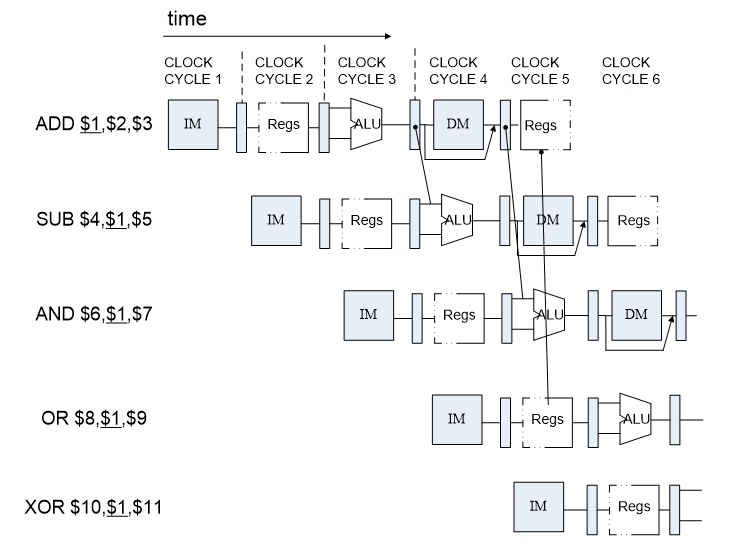
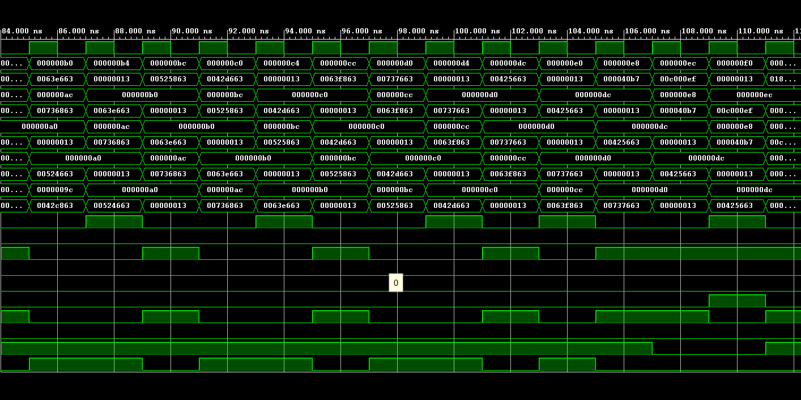
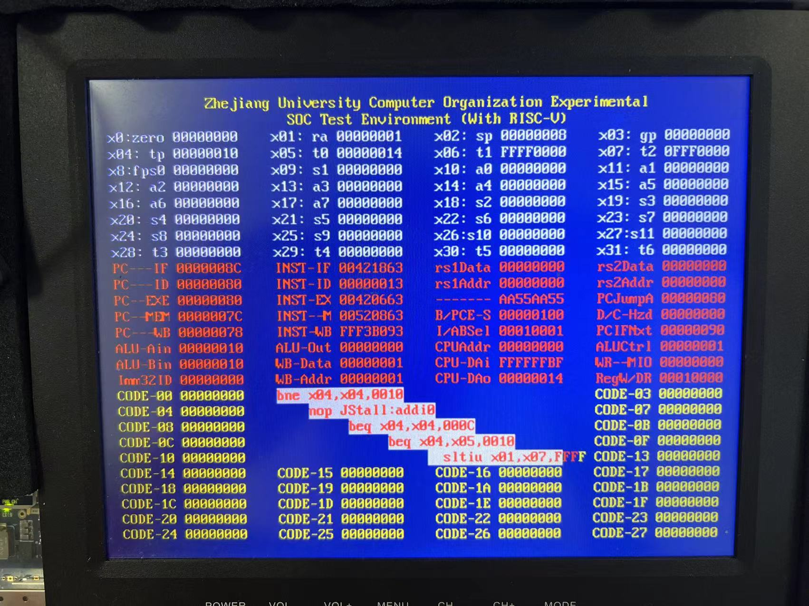

<style>
    pre code { /*实现代码块自动换行*/
        white-space: pre-wrap !important;; /* CSS 3 */
        white-space: -moz-pre-wrap !important; /* Firefox */
        white-space: -pre-wrap !important; /* Opera <7 */
        white-space: -o-pre-wrap !important; /* Opera 7 */
        word-wrap: break-word !important; /* Internet Explorer 5.5+ */
    }
</style>

<div style="height: 100pt;">
</div>

<div style="style=display: block; margin-left: auto; margin-right: auto; width: 60%; height: auto;">
  
  <br>
  <br>
</div>

<div style="height: 40pt;">
</div>

<div style="text-align:center;font-size:20pt;">
    <strong>体系结构实验报告</strong><br>
    <br>
</div>

<div style="height: 80pt;">
</div>

<div style="display: flex; align-items: center;justify-content: center;font-size:14pt;">
  <div style="display:flex; align-items: center; width: 70pt; background-color: rgba(255, 255, 255, 0);justify-content: center;">
课程名称<span style="margin-right: 7pt">:</span>
</div>
<div style="display:flex; align-items: center; width: 300pt; background-color: rgba(255, 255, 255, 0);justify-content: center;border-bottom: 1pt solid #000;">
计算机体系结构
</div>
</div>

<div style="height: 7pt;">
</div>

<div style="display: flex; align-items: center;justify-content: center;font-size:14pt;">
  <div style="display:flex; align-items: center; width: 70pt; background-color: rgba(255, 255, 255, 0);justify-content: center;">
实验项目<span style="margin-right: 7pt">:</span>
</div>
<div style="display:flex; align-items: center; width: 300pt; background-color: rgba(255, 255, 255, 0);justify-content: center;border-bottom: 1pt solid #000;">
支持 RISCV RV32I 的流水线CPU
</div>
</div>

<div style="height: 7pt;">
</div>

<div style="display: flex; align-items: center;justify-content: center;font-size:14pt;">
  <div style="display:flex; align-items: center; width: 70pt; background-color: rgba(255, 255, 255, 0);justify-content: center;">
专<span style="margin-left: 28pt;"></span>业<span style="margin-right: 7pt">:</span>
</div>
<div style="display:flex; align-items: center; width: 300pt; background-color: rgba(255, 255, 255, 0);justify-content: center;border-bottom: 1pt solid #000;">
计算机科学技术
</div>
</div>

<div style="height: 7pt;">
</div>

<div style="display: flex; align-items: center;justify-content: center;font-size:14pt;">
  <div style="display:flex; align-items: center; width: 70pt; background-color: rgba(255, 255, 255, 0);justify-content: center;">
学生姓名<span style="margin-right: 7pt;">:</span>
</div>
<div style="display:flex; align-items: center; width: 300pt; background-color: rgba(255, 255, 255, 0);justify-content: center;border-bottom: 1pt solid #000;">
李浩浩
</div>
</div>

<div style="height: 7pt;">
</div>


<div style="display: flex; align-items: center;justify-content: center;font-size:14pt;">
  <div style="display:flex; align-items: center; width: 70pt; background-color: rgba(255, 255, 255, 0);justify-content: center;">
学<span style="margin-left: 28pt;"></span>号<span style="margin-right: 7pt">:</span>
</div>
<div style="display:flex; align-items: center; width: 300pt; background-color: rgba(255, 255, 255, 0);justify-content: center;border-bottom: 1pt solid #000;">
3220105930
</div>
</div>

<div style="height: 7pt;">
</div>

<div style="display: flex; align-items: center;justify-content: center;font-size:14pt;">
  <div style="display:flex; align-items: center; width: 70pt; background-color: rgba(255, 255, 255, 0);justify-content: center;">
指导老师<span style="margin-right: 7pt">:</span>
</div>
<div style="display:flex; align-items: center; width: 300pt; background-color: rgba(255, 255, 255, 0);justify-content: center;border-bottom: 1pt solid #000;">
何水兵
</div>
</div>

<div style="height: 7pt;">
</div>

<div style="display: flex; align-items: center;justify-content: center;font-size:14pt;">
  <div style="display:flex; align-items: center; width: 70pt; background-color: rgba(255, 255, 255, 0);justify-content: center;">
实验日期<span style="margin-right: 7pt">:</span>
</div>
<div style="display:flex; align-items: center; width: 300pt; background-color: rgba(255, 255, 255, 0);justify-content: center;border-bottom: 1pt solid #000;">
2024年9月24日
</div>
</div>

<div style="height: 7pt;">
</div>

<div style="page-break-before: always;"></div>

<div style="height: 14pt;">
</div>

### 一、实验目的、要求及任务

#### （一）实验目的

- Understand  RISC-V RV32I instructions
- Master the design methods of pipelined CPU executing RV32I instructions
- Master the method of Pipeline Forwarding Detection and bypass unit design
- Master the methods of 1-cycle stall of Predict-not-taken branch design
- Master methods of program verification of Pipelined CPU executing RV32I instructions


#### （二）实验任务

- Design of Pipelined CPU executing RV32I instructions.
    - Design datapath
    - Design Bypass Unit
    - Design CPU Controller
- Verify the Pipelined CPU with program and observe the execution of program


### 二、实验原理

对于没有添加forward的流水线CPU，需要存到寄存器内的数据直到第 5 阶段才能准备好，如果下一条指令需要用到该指令的结果，则至少需要等待 2 个 cycle（将下一条指令的第二阶段与该指令的第五阶段对齐）。但实际上，ALU 的结果在指令的第三阶段就能得到，Load 的结果在第四阶段就能得到，如果能够及时将结果前传，下一条指令的第二阶段就只需与该指令的第三或第四阶段对齐，最多等待 1 cycle。

#### （一）普通数据冲突

指当前指令需要存入寄存器的值在 ALU 阶段得出，该值在存入寄存器之前就有后来的指令将其作为操作数。由于后来指令用到该数值的最早时间在其第三阶段，而该阶段晚于当前指令的第三阶段，所以只需前传即可，不用停顿。
#### （二）use after load

指当前指令为Load型指令，需要存入寄存器的值在该指令的第四阶段末才得到，而其后紧跟的指令需要在其第三阶段初就使用该值，这在时序上无法满足，所以即使在有前传的情况下也需要停顿一个周期。
#### （三）branch


branch指令是否跳转的选择结果在ALU阶段（第三阶段）才会得到，然后需要用一个加法器计算下一条指令的地址，所以到第四阶段才能得到下一条指令确切的地址。在此之前，我们不知道该不该使用下一条指令。

- 如果什么都不做，需要等待 3 cycles 才能继续运行
- 总是假设不跳转，该策略不改变得到下一步指令确切地址的时间，所以如果预测错误的话还是相当于停顿三个周期，预测正确就是顺序执行，所以该策略只是在平均意义上减少停顿时间。
- 总是假设跳转，其余什么都不做，由于不改变确切得到下一步指令地址的时间，还要通过ALU之后的加法器得到跳转地址，所以无论预测对错都没有意义，不会改变停顿周期。
- 总是假设跳转，而且将跳转地址的计算提前到第二阶段（因为立即数最早能在第二阶段得到），此时如果预测正确，而我们是在第二阶段末得到跳转地址的，那么Instruction Memory最早能在branch的第三阶段取出正确的指令，所以需要停顿 1 cycle。如果预测错误（无需跳转），还是需要停顿 3 cycles（因为PC+4在第四阶段才能算出来）
- 总是假设跳转，且将跳转地址的计算和跳转条件的判断提前到第二阶段。因为要等待跳转地址的计算，所以下一步无论如何也要等到branch的第三阶段才能继续执行，但是我们在第三阶段已经具备了所有信息，完全可以直接执行正确的指令，无需预测。所以这种策略总是停顿 1 cycle。
- 总是假设不跳转，且将跳转地址的计算和跳转条件的判断提前到第二阶段。因为PC+4在branch的第一阶段就已经得到了，在branch判断是否跳转的时候PC+4的指令开始执行，所以预测正确的情况下无需停顿。如果在第二阶段发现预测错误，则正确指令在branch的第三阶段开始执行，相当于停顿 1 cycle。

### 三、实验过程及数据记录


上面的图是按照本次实验源码画的，将 forward 和 hazard 合到一起了

#### （一）cmp.v
```verilog
`timescale 1ns / 1ps

module cmp_32(  input [31:0] a,
                input [31:0] b,
                input [2:0] ctrl,
                output c
    );
    parameter cmp_EQ  = 3'b001;
    parameter cmp_NE  = 3'b010;
    parameter cmp_LT  = 3'b011;
    parameter cmp_LTU = 3'b100;
    parameter cmp_GE  = 3'b101;
    parameter cmp_GEU = 3'b110;

    wire res_EQ  = a == b;
    wire res_NE  = ~res_EQ;
    wire res_LT  = (a[31] & ~b[31]) || (~(a[31] ^ b[31]) && a < b);
    wire res_LTU = a < b;
    wire res_GE  = ~res_LT;
    wire res_GEU = ~res_LTU;

    wire EQ  = ctrl == cmp_EQ ; 
    wire NE  = ctrl == cmp_NE ; 
    wire LT  = ctrl == cmp_LT ; 
    wire LTU = ctrl == cmp_LTU;
    wire GE  = ctrl == cmp_GE ; 
    wire GEU = ctrl == cmp_GEU;

    assign c = (EQ ? res_EQ  : (NE ? res_NE  : (LT ? res_LT  : (LTU? res_LTU : (GE ? res_GE  : (GEU? res_GEU : 1'b0)))))); //to fill sth. in ()

endmodule
```

#### （二）CtrlUnit.v
```verilog
`timescale 1ns / 1ps


module CtrlUnit(
    input[31:0] inst,
    input cmp_res,
    output Branch, ALUSrc_A, ALUSrc_B, DatatoReg, RegWrite, mem_w,
        MIO, rs1use, rs2use,
    output [1:0] hazard_optype,
    output [2:0] ImmSel, cmp_ctrl,
    output [3:0] ALUControl,
    output JALR
);

    wire[6:0] funct7 = inst[31:25];
    wire[2:0] funct3 = inst[14:12];
    wire[6:0] opcode = inst[6:0];

    wire Rop = opcode == 7'b0110011;
    wire Iop = opcode == 7'b0010011;
    wire Bop = opcode == 7'b1100011;
    wire Lop = opcode == 7'b0000011;
    wire Sop = opcode == 7'b0100011;

    wire funct7_0  = funct7 == 7'h0;
    wire funct7_32 = funct7 == 7'h20;

    wire funct3_0 = funct3 == 3'h0;
    wire funct3_1 = funct3 == 3'h1;
    wire funct3_2 = funct3 == 3'h2;
    wire funct3_3 = funct3 == 3'h3;
    wire funct3_4 = funct3 == 3'h4;
    wire funct3_5 = funct3 == 3'h5;
    wire funct3_6 = funct3 == 3'h6;
    wire funct3_7 = funct3 == 3'h7;

    wire ADD  = Rop & funct3_0 & funct7_0;
    wire SUB  = Rop & funct3_0 & funct7_32;
    wire SLL  = Rop & funct3_1 & funct7_0;
    wire SLT  = Rop & funct3_2 & funct7_0;
    wire SLTU = Rop & funct3_3 & funct7_0;
    wire XOR  = Rop & funct3_4 & funct7_0;
    wire SRL  = Rop & funct3_5 & funct7_0;
    wire SRA  = Rop & funct3_5 & funct7_32;
    wire OR   = Rop & funct3_6 & funct7_0;
    wire AND  = Rop & funct3_7 & funct7_0;

    wire ADDI  = Iop & funct3_0;	
    wire SLTI  = Iop & funct3_2;
    wire SLTIU = Iop & funct3_3;
    wire XORI  = Iop & funct3_4;
    wire ORI   = Iop & funct3_6;
    wire ANDI  = Iop & funct3_7;
    wire SLLI  = Iop & funct3_1 & funct7_0;
    wire SRLI  = Iop & funct3_5 & funct7_0;
    wire SRAI  = Iop & funct3_5 & funct7_32;

    wire BEQ = Bop & funct3_0;                            //to fill sth. in 
    wire BNE = Bop & funct3_1;                            //to fill sth. in 
    wire BLT = Bop & funct3_4;                            //to fill sth. in 
    wire BGE = Bop & funct3_5;                            //to fill sth. in 
    wire BLTU = Bop & funct3_6;                           //to fill sth. in 
    wire BGEU = Bop & funct3_7;                           //to fill sth. in 

    wire LB =  Lop & funct3_0;                            //to fill sth. in 
    wire LH =  Lop & funct3_1;                            //to fill sth. in 
    wire LW =  Lop & funct3_2;                            //to fill sth. in 
    wire LBU = Lop & funct3_4;                            //to fill sth. in 
    wire LHU = Lop & funct3_5;                            //to fill sth. in 

    wire SB = Sop & funct3_0;                             //to fill sth. in 
    wire SH = Sop & funct3_1;                             //to fill sth. in 
    wire SW = Sop & funct3_2;                             //to fill sth. in 

    wire LUI   = opcode == 7'b0110111;                          //to fill sth. in 
    wire AUIPC = opcode == 7'b0010111;                          //to fill sth. in 

    wire JAL  = opcode == 7'b1101111;                           //to fill sth. in 
    assign JALR = opcode == 7'b1100111;                        //to fill sth. in 

    wire R_valid = AND | OR | ADD | XOR | SLL | SRL | SRA | SUB | SLT | SLTU;
    wire I_valid = ANDI | ORI | ADDI | XORI | SLLI | SRLI | SRAI | SLTI | SLTIU;
    wire B_valid = BEQ | BNE | BLT | BGE | BLTU | BGEU;
    wire L_valid = LW | LH | LB | LHU | LBU;
    wire S_valid = SW | SH | SB;


    assign Branch = (B_valid & cmp_res) | JAL | JALR;                       //to fill sth. in 

    parameter Imm_type_I = 3'b001;
    parameter Imm_type_B = 3'b010;
    parameter Imm_type_J = 3'b011;
    parameter Imm_type_S = 3'b100;
    parameter Imm_type_U = 3'b101;
    assign ImmSel = {3{I_valid | JALR | L_valid}} & Imm_type_I |
                    {3{B_valid}}                  & Imm_type_B |
                    {3{JAL}}                      & Imm_type_J |
                    {3{S_valid}}                  & Imm_type_S |
                    {3{LUI | AUIPC}}              & Imm_type_U ;


    assign cmp_ctrl = {3{BEQ}}  & 3'b001 |                         //to fill sth. in 
                      {3{BNE}}  & 3'b010 |
                      {3{BLT}}  & 3'b011 |
                      {3{BGE}}  & 3'b101 |
                      {3{BLTU}} & 3'b100 |
                      {3{BGEU}} & 3'b110 ;

    assign ALUSrc_A = JAL | JALR | AUIPC;                         //to fill sth. in // active when pc is used as rs1

    assign ALUSrc_B = ~(R_valid | B_valid | JAL | JALR);                         //to fill sth. in // active when immediate is used as rs2

    parameter ALU_ADD  = 4'b0001;
    parameter ALU_SUB  = 4'b0010;
    parameter ALU_AND  = 4'b0011;
    parameter ALU_OR   = 4'b0100;
    parameter ALU_XOR  = 4'b0101;
    parameter ALU_SLL  = 4'b0110;
    parameter ALU_SRL  = 4'b0111;
    parameter ALU_SLT  = 4'b1000;
    parameter ALU_SLTU = 4'b1001;
    parameter ALU_SRA  = 4'b1010;
    parameter ALU_Ap4  = 4'b1011;
    parameter ALU_Bout = 4'b1100;
    assign ALUControl = {4{ADD | ADDI | L_valid | S_valid | AUIPC}} & ALU_ADD  |
                        {4{SUB}}                                    & ALU_SUB  |
                        {4{AND | ANDI}}                             & ALU_AND  |
                        {4{OR | ORI}}                               & ALU_OR   |
                        {4{XOR | XORI}}                             & ALU_XOR  |
                        {4{SLL | SLLI}}                             & ALU_SLL  |
                        {4{SRL | SRLI}}                             & ALU_SRL  |
                        {4{SLT | SLTI}}                             & ALU_SLT  |
                        {4{SLTU | SLTIU}}                           & ALU_SLTU |
                        {4{SRA | SRAI}}                             & ALU_SRA  |
                        {4{JAL | JALR}}                             & ALU_Ap4  |
                        {4{LUI}}                                    & ALU_Bout ;

    assign DatatoReg = L_valid;

    assign RegWrite = R_valid | I_valid | JAL | JALR | L_valid | LUI | AUIPC;

    assign mem_w = S_valid;

    assign MIO = L_valid | S_valid;

    assign rs1use = ~(LUI|AUIPC|JAL);                      //to fill sth. in 

    assign rs2use = Rop|Sop|Bop;                        //to fill sth. in 

    localparam hazard_optype_ALU = 2'b01;               //current operation uses ALU
    localparam hazard_optype_LOAD = 2'b10;              //current operation loads data from memory
    localparam hazard_optype_STORE = 2'b11;             //current operation stores data to memory

    assign hazard_optype = {2{R_valid | I_valid | LUI | AUIPC | JAL | JALR}} & hazard_optype_ALU  |
                           {2{L_valid}}                                      & hazard_optype_LOAD |
                           {2{S_valid}}                                      & hazard_optype_STORE;                  //to fill sth. in 

endmodule
```

#### （三）HazardDetectionUnit.v

```verilog
`timescale 1ps/1ps

module HazardDetectionUnit(
    input clk,
    input Branch_ID, rs1use_ID, rs2use_ID,
    input[1:0] hazard_optype_ID,
    input[4:0] rd_EXE, rd_MEM, rs1_ID, rs2_ID, rs2_EXE,
    output PC_EN_IF, reg_FD_EN, reg_FD_stall, reg_FD_flush,
        reg_DE_EN, reg_DE_flush, reg_EM_EN, reg_EM_flush, reg_MW_EN,
    output forward_ctrl_ls,
    output[1:0] forward_ctrl_A, forward_ctrl_B
);
    //according to the diagram, design the Hazard Detection Unit

    //activate registers
    assign reg_FD_EN = 1'b1;
    assign reg_DE_EN = 1'b1;
    assign reg_EM_EN = 1'b1;
    assign reg_MW_EN = 1'b1;

    //hazard operation type transfer
    reg[1:0] hazard_optype_EXE, hazard_optype_MEM;
    always@(posedge clk)begin
        hazard_optype_MEM <= hazard_optype_EXE;
        hazard_optype_EXE <= hazard_optype_ID & {2{~reg_DE_flush}};     //there is no data hazard in EXE stage if DE flush is active
    end

    //forward and stall control logic
    localparam hazard_optype_ALU   = 2'b01;
    localparam hazard_optype_LOAD  = 2'b10;
    localparam hazard_optype_STORE = 2'b11;

    wire rs1_stall = rs1use_ID && rs1_ID && (rs1_ID == rd_EXE) && (hazard_optype_EXE == hazard_optype_LOAD);//rs2 of store instruction is only used in MEM stage, but rs1 is used in EXE stage
    wire rs2_stall = rs2use_ID && rs2_ID && (rs2_ID == rd_EXE) && (hazard_optype_EXE == hazard_optype_LOAD) && (hazard_optype_ID != hazard_optype_STORE);

    wire rs1_forward_from_EXE = rs1use_ID && rs1_ID && (rs1_ID == rd_EXE) && (hazard_optype_EXE == hazard_optype_ALU);
    wire rs2_forward_from_EXE = rs2use_ID && rs2_ID && (rs2_ID == rd_EXE) && (hazard_optype_EXE == hazard_optype_ALU);

    wire rs1_forward_from_MEM_ALU = (~rs1_forward_from_EXE) && rs1use_ID && rs1_ID && (rs1_ID == rd_MEM) && (hazard_optype_MEM == hazard_optype_ALU);// if EXE stage is not hazardous, then rs1 can be forwarded from MEM stage
    wire rs2_forward_from_MEM_ALU = (~rs2_forward_from_EXE) && rs2use_ID && rs2_ID && (rs2_ID == rd_MEM) && (hazard_optype_MEM == hazard_optype_ALU);

    wire rs1_forward_from_MEM_LOAD = rs1use_ID && rs1_ID && (rs1_ID == rd_MEM) && (hazard_optype_MEM == hazard_optype_LOAD);// forward loaded data from MEM stage to ID stage
    wire rs2_forward_from_MEM_LOAD = rs2use_ID && rs2_ID && (rs2_ID == rd_MEM) && (hazard_optype_MEM == hazard_optype_LOAD);

    wire rs2_EXE_forward_from_MEM = rs2_EXE && (rs2_EXE == rd_MEM) && (hazard_optype_MEM == hazard_optype_LOAD) && (hazard_optype_EXE == hazard_optype_STORE);

    wire stall = rs1_stall | rs2_stall;

    assign PC_EN_IF = ~stall;
    assign reg_FD_stall = stall;
    assign reg_FD_flush = Branch_ID;
    assign reg_DE_flush = stall;

    assign forward_ctrl_A = {2{rs1_forward_from_EXE}}      & 2'b01 |
                            {2{rs1_forward_from_MEM_ALU}}  & 2'b10 |
                            {2{rs1_forward_from_MEM_LOAD}} & 2'b11 ;
    assign forward_ctrl_B = {2{rs2_forward_from_EXE}}      & 2'b01 |
                            {2{rs2_forward_from_MEM_ALU}}  & 2'b10 |
                            {2{rs2_forward_from_MEM_LOAD}} & 2'b11 ;
    assign forward_ctrl_ls = rs2_EXE_forward_from_MEM;

endmodule
```

#### （四）RV32core.v

按照前面的结构图连线即可。

### 四、实验结果分析

#### （一）仿真





与ppt上的图片一模一样

#### （二）上板




