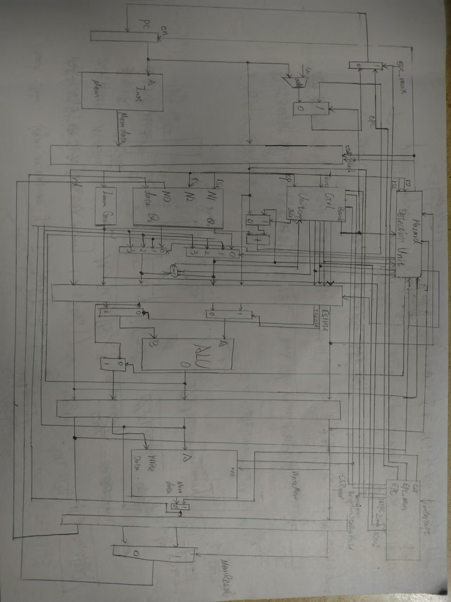
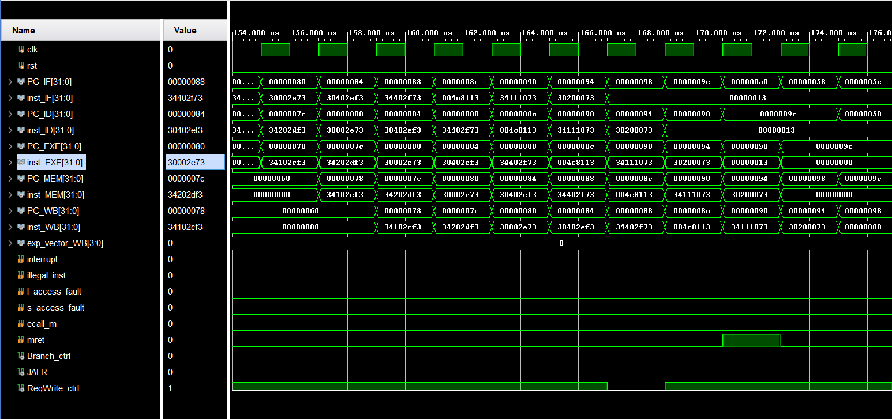

<style>
    pre code { /*实现代码块自动换行*/
        white-space: pre-wrap !important;; /* CSS 3 */
        white-space: -moz-pre-wrap !important; /* Firefox */
        white-space: -pre-wrap !important; /* Opera <7 */
        white-space: -o-pre-wrap !important; /* Opera 7 */
        word-wrap: break-word !important; /* Internet Explorer 5.5+ */
    }
</style>

<div style="height: 100pt;">
</div>

<div style="style=display: block; margin-left: auto; margin-right: auto; width: 60%; height: auto;">
  
  <br>
  <br>
</div>

<div style="height: 40pt;">
</div>

<div style="text-align:center;font-size:20pt;">
    <strong>体系结构实验报告</strong><br>
    <br>
</div>

<div style="height: 80pt;">
</div>

<div style="display: flex; align-items: center;justify-content: center;font-size:14pt;">
  <div style="display:flex; align-items: center; width: 70pt; background-color: rgba(255, 255, 255, 0);justify-content: center;">
课程名称<span style="margin-right: 7pt">:</span>
</div>
<div style="display:flex; align-items: center; width: 300pt; background-color: rgba(255, 255, 255, 0);justify-content: center;border-bottom: 1pt solid #000;">
计算机体系结构
</div>
</div>

<div style="height: 7pt;">
</div>

<div style="display: flex; align-items: center;justify-content: center;font-size:14pt;">
  <div style="display:flex; align-items: center; width: 70pt; background-color: rgba(255, 255, 255, 0);justify-content: center;">
实验项目<span style="margin-right: 7pt">:</span>
</div>
<div style="display:flex; align-items: center; width: 300pt; background-color: rgba(255, 255, 255, 0);justify-content: center;border-bottom: 1pt solid #000;">
Pipelined CPU supporting exception & interrupt
</div>
</div>

<div style="height: 7pt;">
</div>

<div style="display: flex; align-items: center;justify-content: center;font-size:14pt;">
  <div style="display:flex; align-items: center; width: 70pt; background-color: rgba(255, 255, 255, 0);justify-content: center;">
专<span style="margin-left: 28pt;"></span>业<span style="margin-right: 7pt">:</span>
</div>
<div style="display:flex; align-items: center; width: 300pt; background-color: rgba(255, 255, 255, 0);justify-content: center;border-bottom: 1pt solid #000;">
计算机科学技术
</div>
</div>

<div style="height: 7pt;">
</div>

<div style="display: flex; align-items: center;justify-content: center;font-size:14pt;">
  <div style="display:flex; align-items: center; width: 70pt; background-color: rgba(255, 255, 255, 0);justify-content: center;">
学生姓名<span style="margin-right: 7pt;">:</span>
</div>
<div style="display:flex; align-items: center; width: 300pt; background-color: rgba(255, 255, 255, 0);justify-content: center;border-bottom: 1pt solid #000;">
李浩浩
</div>
</div>

<div style="height: 7pt;">
</div>


<div style="display: flex; align-items: center;justify-content: center;font-size:14pt;">
  <div style="display:flex; align-items: center; width: 70pt; background-color: rgba(255, 255, 255, 0);justify-content: center;">
学<span style="margin-left: 28pt;"></span>号<span style="margin-right: 7pt">:</span>
</div>
<div style="display:flex; align-items: center; width: 300pt; background-color: rgba(255, 255, 255, 0);justify-content: center;border-bottom: 1pt solid #000;">
3220105930
</div>
</div>

<div style="height: 7pt;">
</div>

<div style="display: flex; align-items: center;justify-content: center;font-size:14pt;">
  <div style="display:flex; align-items: center; width: 70pt; background-color: rgba(255, 255, 255, 0);justify-content: center;">
指导老师<span style="margin-right: 7pt">:</span>
</div>
<div style="display:flex; align-items: center; width: 300pt; background-color: rgba(255, 255, 255, 0);justify-content: center;border-bottom: 1pt solid #000;">
何水兵
</div>
</div>

<div style="height: 7pt;">
</div>

<div style="display: flex; align-items: center;justify-content: center;font-size:14pt;">
  <div style="display:flex; align-items: center; width: 70pt; background-color: rgba(255, 255, 255, 0);justify-content: center;">
实验日期<span style="margin-right: 7pt">:</span>
</div>
<div style="display:flex; align-items: center; width: 300pt; background-color: rgba(255, 255, 255, 0);justify-content: center;border-bottom: 1pt solid #000;">
2024年10月30日
</div>
</div>

<div style="height: 7pt;">
</div>

<div style="page-break-before: always;"></div>

<div style="height: 14pt;">
</div>

### 一、实验目的、要求及任务

#### （一）实验目的

- Understand  the principle of CPU exception & interrupt and its processing procedure.
- Master the design methods of pipelined CPU supporting exception & interrupt.
- master methods of program verification of Pipelined CPU supporting exception & interrupt.


#### （二）实验任务

- Design of Pipelined CPU supporting exception & interrupt.
    - Design datapath
    - Design Co-processor & Controller
- Verify the Pipelined CPU with program and observe the execution of program


### 二、实验原理

处理异常中断的大概思路是，当CPU检测到中断请求或异常时，保存当前CPU的上下文，跳转到并执行中断异常处理程序，处理完成后恢复CPU上下文，从中断、异常处继续执行。以下是一些细节。

#### 2.1 CPU如何检测中断请求和异常

根据终端和异常的定义，中断通常由外部设备引起，由外部设备向CPU发送中断请求，具体表现为1 bit 的interrupt信号；而异常则是由内部原因引起的，例如非法指令、内存访问错误，直接由CPU判断。

#### 2.2 如何保存CPU上下文

CPU上下文包括CPU的寄存器内容，其保存工作由汇编程序指导CPU完成。

#### 2.3 如何跳转并执行处理程序并返回

中断和异常的处理程序地址存储在CSR寄存器MTVEC中，CPU只需要读出其值即可，但是从处理程序返回并执行原来的程序需要知道原本程序的PC，这个值需要在跳转之前存储在CSR寄存器MEPC中，在CPU执行到处理程序末尾的mret指令后跳转到MEPC所指向的地址。如果是中断，MEPC应当存储下一条指令的地址，如果是异常则存储当前指令的地址。

#### 2.4 其他

目前我们的实现比较简陋，在执行中断异常处理程序的时候无法处理额外的中断，所以在跳转到处理程序之前需要把mstatus寄存器的mie置为0，表示不允许中断，同时将以前的mie位存储到mpie位，以期在返回时恢复。

处理程序可以处理中断和异常，它需要知道自己为什么会被调用，这相关的信息存储在CSR寄存器mcause中，所以在跳转之前我们还需要按照下表设置mcause


### 三、实验过程及数据记录



#### ExceptionUnit.v

```verilog
`timescale 1ns / 1ps

module ExceptionUnit(
    input clk, rst,
    input csr_rw_in,                  //判断当前指令是否为CSR类
    input[1:0] csr_wsc_mode_in,       //标记CSR指令的种类
    input csr_w_imm_mux,              //判断参与运算的操作数是立即数还是cpu寄存器内容
    input[11:0] csr_rw_addr_in,       //表示CSR指令中涉及的CSR寄存器的地址
    input[31:0] csr_w_data_reg,       //假设操作数是寄存器，表示寄存器的内容
    input[4:0] csr_w_data_imm,        //假设操作数是立即数，表示立即数
    output[31:0] csr_r_data_out,      //表示CSR指令需要存入rd的内容

    input interrupt,                  //表示外设是否产生中断请求
    input illegal_inst,               //指令是否为非法指令
    input l_access_fault,             //读内存地址错误
    input s_access_fault,             //写内存地址错误
    input ecall_m,                    //该指令是否为ECALL

    input mret,                       //该指令是否为MRET

    input[31:0] epc_cur,              //出现异常时，导致异常的指令
    input[31:0] epc_next,             //导致异常指令结束后执行的指令
    output[31:0] PC_redirect,         //重定向的地址
    output redirect_mux,              //是否需要重定向

    output reg_FD_flush, reg_DE_flush, reg_EM_flush, reg_MW_flush, 
    output RegWrite_cancel            //是否需要取消写寄存器
);

    reg[11:0] csr_raddr, csr_waddr;
    reg[31:0] csr_wdata;
    reg csr_w;
    reg[1:0] csr_wsc;

    wire[31:0] mstatus;

    reg[1:0] state = 2'd0;
    reg[1:0] next_state = 2'd0;
    reg[31:0] EPC;
    reg[31:0] CAUSE;

    parameter MSTATUS = 12'h300;
    parameter MTVEC   = 12'h305;
    parameter MEPC    = 12'h341;
    parameter MCAUSE  = 12'h342;
    parameter MTVAL   = 12'h343;
    parameter MIE     = 12'h304;

    parameter STATE_IDEL = 2'd0;
    parameter STATE_MEPC = 2'd1;
    parameter STATE_MCAUSE = 2'd2;
    
    wire exception, trap_in;

    assign reg_FD_flush = (state == STATE_IDEL) & (trap_in | mret) | state == STATE_MEPC;
    assign reg_DE_flush = (state == STATE_IDEL) & (trap_in | mret);
    assign reg_EM_flush = (state == STATE_IDEL) & (trap_in | mret);
    assign reg_MW_flush = (state == STATE_IDEL) & trap_in;

    assign exception = illegal_inst | l_access_fault | s_access_fault | ecall_m;
    assign trap_in = exception | interrupt;

    assign PC_redirect = csr_r_data_out;
    assign redirect_mux = (state == STATE_IDEL & mret) | (state == STATE_MEPC);

    assign RegWrite_cancel = state == STATE_IDEL & exception;

    always @* begin
        case(state)
        STATE_IDEL:begin
            if (trap_in) begin
                csr_w <=1;
                csr_wsc <= 2'd1;
                csr_waddr <= MSTATUS;
                csr_wdata <= {mstatus[31:8], mstatus[3], mstatus[6:4], 1'b0, mstatus[2:0]};

                EPC <= exception ? epc_cur : epc_next;
                CAUSE <= interrupt ? {1'd1, 31'd0} : (illegal_inst ? 32'd2 : (l_access_fault ? 32'd5 : (s_access_fault ? 32'd7 : (ecall_m ? 32'd11 : 32'd0))));

                next_state <= STATE_MEPC;
            end
            else if (mret) begin
                csr_w <=1;
                csr_wsc <= 2'd1;
                csr_raddr <= MEPC;
                csr_waddr <= MSTATUS;
                csr_wdata <= {mstatus[31:8], 1'b0, mstatus[6:4], mstatus[7], mstatus[2:0]};

                next_state <= STATE_IDEL;
            end
            else if (csr_rw_in) begin
                csr_w <= 1;
                csr_wsc <= csr_wsc_mode_in;
                csr_raddr <= csr_rw_addr_in;
                csr_waddr <= csr_rw_addr_in;
                csr_wdata <= csr_w_imm_mux ? {{27'd0},csr_w_data_imm} : csr_w_data_reg;

                next_state <= STATE_IDEL;
            end
            else begin
                csr_w <= 0;

                next_state <= STATE_IDEL;
            end
        end
        STATE_MEPC:begin
            csr_w <= 1;
            csr_wsc <= 2'd1;
            csr_raddr <= MTVEC;
            csr_waddr <= MEPC;
            csr_wdata <= EPC;

            next_state <= STATE_MCAUSE;
        end
        STATE_MCAUSE:begin
            csr_w <= 1;
            csr_wsc <= 2'd1;
            csr_waddr <= MCAUSE;
            csr_wdata <= CAUSE;
            
            next_state <= STATE_IDEL;
        end
        endcase
    end

    always @(posedge clk or posedge rst) begin
        if (rst) begin
            state <= STATE_IDEL;
        end
        else begin
            state <= next_state;
        end
    end

    CSRRegs csr(.clk(clk),.rst(rst),.csr_w(csr_w),.raddr(csr_raddr),.waddr(csr_waddr),
        .wdata(csr_wdata),.rdata(csr_r_data_out),.mstatus(mstatus),.csr_wsc_mode(csr_wsc));

endmodule
```

### 四、实验结果分析

#### （一）仿真





#### （二）上板


