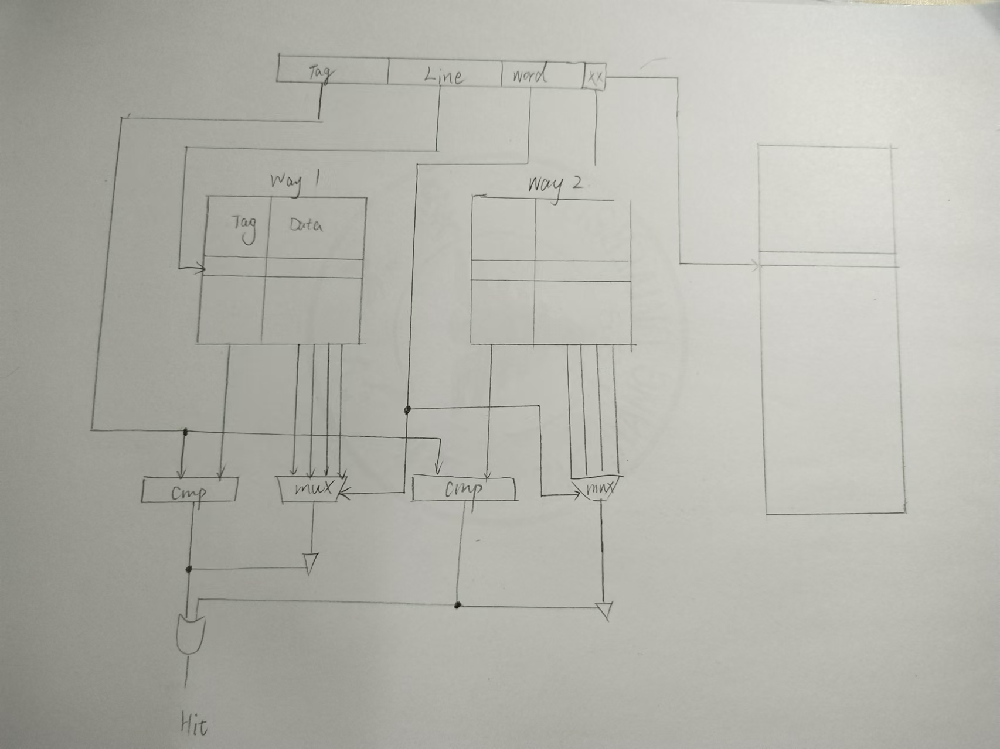
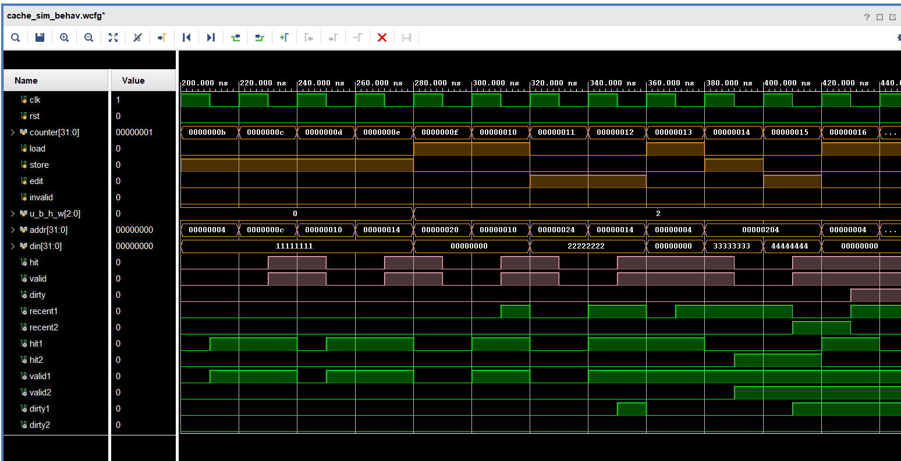
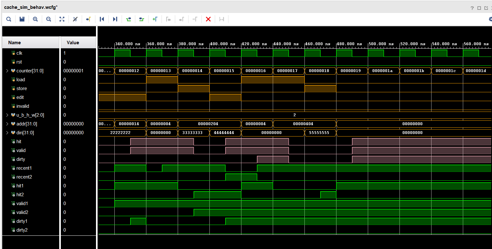

<style>
    pre code { /*实现代码块自动换行*/
        white-space: pre-wrap !important;; /* CSS 3 */
        white-space: -moz-pre-wrap !important; /* Firefox */
        white-space: -pre-wrap !important; /* Opera <7 */
        white-space: -o-pre-wrap !important; /* Opera 7 */
        word-wrap: break-word !important; /* Internet Explorer 5.5+ */
    }
</style>

<div style="height: 100pt;">
</div>

<div style="style=display: block; margin-left: auto; margin-right: auto; width: 60%; height: auto;">
  
  <br>
  <br>
</div>

<div style="height: 40pt;">
</div>

<div style="text-align:center;font-size:20pt;">
    <strong>体系结构实验报告</strong><br>
    <br>
</div>

<div style="height: 80pt;">
</div>

<div style="display: flex; align-items: center;justify-content: center;font-size:14pt;">
  <div style="display:flex; align-items: center; width: 70pt; background-color: rgba(255, 255, 255, 0);justify-content: center;">
课程名称<span style="margin-right: 7pt">:</span>
</div>
<div style="display:flex; align-items: center; width: 300pt; background-color: rgba(255, 255, 255, 0);justify-content: center;border-bottom: 1pt solid #000;">
计算机体系结构
</div>
</div>

<div style="height: 7pt;">
</div>

<div style="display: flex; align-items: center;justify-content: center;font-size:14pt;">
  <div style="display:flex; align-items: center; width: 70pt; background-color: rgba(255, 255, 255, 0);justify-content: center;">
实验项目<span style="margin-right: 7pt">:</span>
</div>
<div style="display:flex; align-items: center; width: 300pt; background-color: rgba(255, 255, 255, 0);justify-content: center;border-bottom: 1pt solid #000;">
Pipelined CPU supporting exception & interrupt
</div>
</div>

<div style="height: 7pt;">
</div>

<div style="display: flex; align-items: center;justify-content: center;font-size:14pt;">
  <div style="display:flex; align-items: center; width: 70pt; background-color: rgba(255, 255, 255, 0);justify-content: center;">
专<span style="margin-left: 28pt;"></span>业<span style="margin-right: 7pt">:</span>
</div>
<div style="display:flex; align-items: center; width: 300pt; background-color: rgba(255, 255, 255, 0);justify-content: center;border-bottom: 1pt solid #000;">
计算机科学技术
</div>
</div>

<div style="height: 7pt;">
</div>

<div style="display: flex; align-items: center;justify-content: center;font-size:14pt;">
  <div style="display:flex; align-items: center; width: 70pt; background-color: rgba(255, 255, 255, 0);justify-content: center;">
学生姓名<span style="margin-right: 7pt;">:</span>
</div>
<div style="display:flex; align-items: center; width: 300pt; background-color: rgba(255, 255, 255, 0);justify-content: center;border-bottom: 1pt solid #000;">
李浩浩
</div>
</div>

<div style="height: 7pt;">
</div>


<div style="display: flex; align-items: center;justify-content: center;font-size:14pt;">
  <div style="display:flex; align-items: center; width: 70pt; background-color: rgba(255, 255, 255, 0);justify-content: center;">
学<span style="margin-left: 28pt;"></span>号<span style="margin-right: 7pt">:</span>
</div>
<div style="display:flex; align-items: center; width: 300pt; background-color: rgba(255, 255, 255, 0);justify-content: center;border-bottom: 1pt solid #000;">
3220105930
</div>
</div>

<div style="height: 7pt;">
</div>

<div style="display: flex; align-items: center;justify-content: center;font-size:14pt;">
  <div style="display:flex; align-items: center; width: 70pt; background-color: rgba(255, 255, 255, 0);justify-content: center;">
指导老师<span style="margin-right: 7pt">:</span>
</div>
<div style="display:flex; align-items: center; width: 300pt; background-color: rgba(255, 255, 255, 0);justify-content: center;border-bottom: 1pt solid #000;">
何水兵
</div>
</div>

<div style="height: 7pt;">
</div>

<div style="display: flex; align-items: center;justify-content: center;font-size:14pt;">
  <div style="display:flex; align-items: center; width: 70pt; background-color: rgba(255, 255, 255, 0);justify-content: center;">
实验日期<span style="margin-right: 7pt">:</span>
</div>
<div style="display:flex; align-items: center; width: 300pt; background-color: rgba(255, 255, 255, 0);justify-content: center;border-bottom: 1pt solid #000;">
2024年11月4日
</div>
</div>

<div style="height: 7pt;">
</div>

<div style="page-break-before: always;"></div>

<div style="height: 14pt;">
</div>

### 一、实验目的、要求及任务

#### （一）实验目的

- Understand  Cache Line.
- Understand  the principle of Cache Management Unit (CMU) and State Machine of - CMU.
- Master the design methods of CMU.
- Master the design methods of Cache Line.
- master verification methods of Cache Line.


#### （二）实验任务

- Design of Cache Line and CMU.

- Verify the Cache Line and CMU.

- Observe the Waveform of Simulation.


### 二、实验原理

此次实验我们要实现的是二路组相联缓存，使用写回和写申请策略。

缓存的作用是保存最近使用过的数据，当CPU中的程序需要数据时，cache将数据所在的block从内存中取出，存储到cache中，所以当程序需要的数据的时间、空间局部性较强时，cache能够大大减少获取数据消耗的时间。

### 三、实验过程及数据记录



#### cache.v

```verilog
// | ----------- address 32 ----------- |
// | 31   9 | 8     4 | 3    2 | 1    0 |
// | tag 23 | index 5 | word 2 | byte 2 |

module cache (
	input wire clk,  // clock
	input wire rst,  // reset
	input wire [ADDR_BITS-1:0] addr,  // address
    input wire load,    //  read refreshes recent bit
	input wire store,  // set valid to 1 and reset dirty to 0
	input wire edit,  // set dirty to 1
	input wire invalid,  // reset valid to 0
    input wire [2:0] u_b_h_w, // select signed or not & data width
                              // please refer to definition of LB, LH, LW, LBU, LHU in RV32I Instruction Set  
	input wire [31:0] din,  // data write in
	output reg hit = 0,  // hit or not
	output reg [31:0] dout = 0,  // data read out
	output reg valid = 0,  // valid bit
	output reg dirty = 0,  // dirty bit
	output reg [TAG_BITS-1:0] tag = 0  // tag bits
	);

    `include "addr_define.vh"

    wire [31:0] word1, word2;
    wire [15:0] half_word1, half_word2;
    wire [7:0]  byte1, byte2;
    wire recent1, recent2, valid1, valid2, dirty1, dirty2;
    wire [TAG_BITS-1:0] tag1, tag2;
    wire hit1, hit2;

    reg [ELEMENT_NUM-1:0] inner_recent = 0;
    reg [ELEMENT_NUM-1:0] inner_valid = 0;
    reg [ELEMENT_NUM-1:0] inner_dirty = 0;
    reg [TAG_BITS-1:0] inner_tag [0:ELEMENT_NUM-1];
    // 64 elements, 2 ways set associative => 32 sets
    reg [31:0] inner_data [0:ELEMENT_NUM*ELEMENT_WORDS-1];

    // initialize tag and data with 0
    integer i;
    initial begin
        for (i = 0; i < ELEMENT_NUM; i = i + 1)
            inner_tag[i] = 23'b0;

        for (i = 0; i < ELEMENT_NUM*ELEMENT_WORDS; i = i + 1)
            inner_data[i] = 32'b0;
    end

    // the bits in an input address:
    wire [TAG_BITS-1:0] addr_tag;
    wire [SET_INDEX_WIDTH-1:0] addr_index;     // idx of set
    wire [ELEMENT_INDEX_WIDTH-1:0] addr_element1; 
    wire [ELEMENT_INDEX_WIDTH-1:0] addr_element2;     // idx of element
    wire [ELEMENT_INDEX_WIDTH+ELEMENT_WORDS_WIDTH-1:0] addr_word1;
    wire [ELEMENT_INDEX_WIDTH+ELEMENT_WORDS_WIDTH-1:0] addr_word2; // element index + word index

    assign addr_tag = addr[ADDR_BITS-1 : ADDR_BITS-TAG_BITS];             //need to fill in
    assign addr_index = addr[ADDR_BITS-TAG_BITS-1 : ADDR_BITS-TAG_BITS-SET_INDEX_WIDTH];           //need to fill in
    assign addr_element1 = {addr_index, 1'b0};
    assign addr_element2 = {addr_index, 1'b1};      //need to fill in
    assign addr_word1 = {addr_element1, addr[ELEMENT_WORDS_WIDTH+WORD_BYTES_WIDTH-1:WORD_BYTES_WIDTH]};
    assign addr_word2 = {addr_element2, addr[ELEMENT_WORDS_WIDTH+WORD_BYTES_WIDTH-1:WORD_BYTES_WIDTH]};           //need to fill in

    assign word1 = inner_data[addr_word1];
    assign word2 = inner_data[addr_word2];                //need to fill in
    assign half_word1 = addr[1] ? word1[31:16] : word1[15:0];
    assign half_word2 = addr[1] ? word2[31:16] : word2[15:0];           //need to fill in
    assign byte1 = addr[1] ?
                    addr[0] ? word1[31:24] : word1[23:16] :
                    addr[0] ? word1[15:8] :  word1[7:0]   ;
    assign byte2 = addr[1] ?
                    addr[0] ? word2[31:24] : word2[23:16] :
                    addr[0] ? word2[15:8] :  word2[7:0]   ;                //need to fill in

    assign recent1 = inner_recent[addr_element1];
    assign recent2 = inner_recent[addr_element2];              //need to fill in
    assign valid1 = inner_valid[addr_element1];
    assign valid2 = inner_valid[addr_element2];               //need to fill in
    assign dirty1 = inner_dirty[addr_element1];
    assign dirty2 = inner_dirty[addr_element2];               //need to fill in
    assign tag1 = inner_tag[addr_element1];
    assign tag2 = inner_tag[addr_element2];                 //need to fill in

    assign hit1 = valid1 & (tag1 == addr_tag);
    assign hit2 = valid2 & (tag2 == addr_tag);                 //need to fill in

    always @ (posedge clk) begin
        valid <= hit1 ? valid1 : (hit2 ? valid2 : 1'b0);                  //need to fill in
        dirty <= hit1 ? dirty1 : (hit2 ? dirty2 : 1'b0);                  //need to fill in
        tag <= hit ? addr_tag : {TAG_BITS{0}};                    //need to fill in
        hit <= hit1 | hit2;                    //need to fill in
        
        // read $ with load==0 means moving data from $ to mem
        // no need to update recent bit
        // otherwise the refresh process will be affected
        if (load) begin
            if (hit1) begin
                dout <=
                    u_b_h_w[1] ? word1 :
                    u_b_h_w[0] ? {u_b_h_w[2] ? 16'b0 : {16{half_word1[15]}}, half_word1} :
                    {u_b_h_w[2] ? 24'b0 : {24{byte1[7]}}, byte1};
                
                // inner_recent will be refreshed only on r/w hit
                // (including the r/w hit after miss and replacement)
                inner_recent[addr_element1] <= 1'b1;
                inner_recent[addr_element2] <= 1'b0;
            end
            else if (hit2) begin
                dout <=
                    u_b_h_w[1] ? word2 :
                    u_b_h_w[0] ? {u_b_h_w[2] ? 16'b0 : {16{half_word2[15]}}, half_word2} :
                    {u_b_h_w[2] ? 24'b0 : {24{byte2[7]}}, byte2};
                
                // inner_recent will be refreshed only on r/w hit
                // (including the r/w hit after miss and replacement)
                inner_recent[addr_element1] <= 1'b0;
                inner_recent[addr_element2] <= 1'b1;
            end
        end
        else dout <= inner_data[ recent1 ? addr_word2 : addr_word1 ];

        if (edit) begin
            if (hit1) begin
                inner_data[addr_word1] <= 
                    u_b_h_w[1] ?        // word?
                        din
                    :
                        u_b_h_w[0] ?    // half word?
                            addr[1] ?       // upper / lower?
                                {din[15:0], word1[15:0]} 
                            :
                                {word1[31:16], din[15:0]} 
                        :   // byte
                            addr[1] ?
                                addr[0] ?
                                    {din[7:0], word1[23:0]}   // 11
                                :
                                    {word1[31:24], din[7:0], word1[15:0]} // 10
                            :
                                addr[0] ?
                                    {word1[31:16], din[7:0], word1[7:0]}   // 01
                                :
                                    {word1[31:8], din[7:0]} // 00
                ;
                inner_dirty[addr_element1] <= 1'b1;
                inner_recent[addr_element1] <= 1'b1;
                inner_recent[addr_element2] <= 1'b0;
            end
            else if (hit2) begin
                inner_data[addr_word2] <= 
                    u_b_h_w[1] ?        // word?
                        din
                    :
                        u_b_h_w[0] ?    // half word?
                            addr[1] ?       // upper / lower?
                                {din[15:0], word2[15:0]} 
                            :
                                {word2[31:16], din[15:0]} 
                        :   // byte
                            addr[1] ?
                                addr[0] ?
                                    {din[7:0], word2[23:0]}   // 11
                                :
                                    {word2[31:24], din[7:0], word2[15:0]} // 10
                            :
                                addr[0] ?
                                    {word2[31:16], din[7:0], word2[7:0]}   // 01
                                :
                                    {word2[31:8], din[7:0]} // 00
                ;
                inner_dirty[addr_element1] <= 1'b1;
                inner_recent[addr_element1] <= 1'b0;
                inner_recent[addr_element2] <= 1'b1;
            end
        end

        if (store) begin
            if (recent1) begin  // replace 2
                inner_data[addr_word2] <= din;
                inner_valid[addr_element2] <= 1'b1;
                inner_dirty[addr_element2] <= 1'b0;
                inner_tag[addr_element2] <= addr_tag;
            end else begin
                // recent2 == 1 => replace 1
                // recent2 == 0 => no data in this set, place to 1
                inner_data[addr_word1] <= din;
                inner_valid[addr_element1] <= 1'b1;
                inner_dirty[addr_element1] <= 1'b0;
                inner_tag[addr_element1] <= addr_tag;
            end
        end

        // not used currently, can be used to reset the cache.
        if (invalid) begin
            inner_recent[addr_element1] <= 1'b0;
            inner_recent[addr_element2] <= 1'b0;
            inner_valid[addr_element1] <= 1'b0;
            inner_valid[addr_element2] <= 1'b0;
            inner_dirty[addr_element1] <= 1'b0;
            inner_dirty[addr_element2] <= 1'b0;
        end
    end

endmodule
```

### 四、实验结果分析

#### （一）仿真




#### （二）上板
无