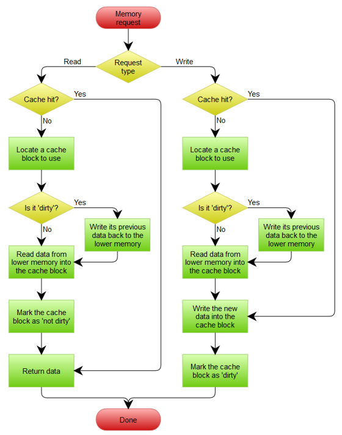
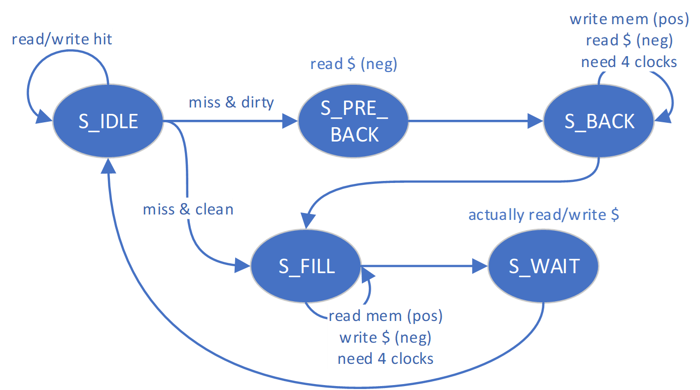
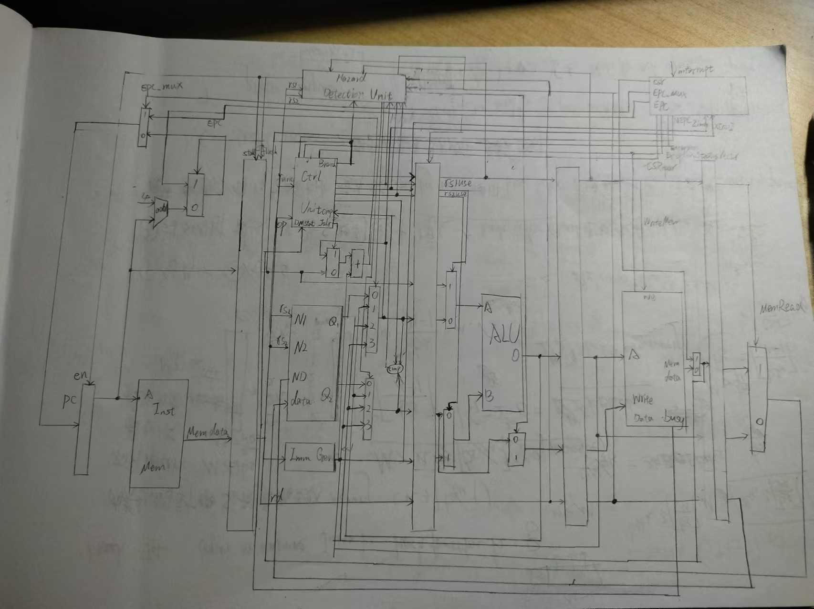
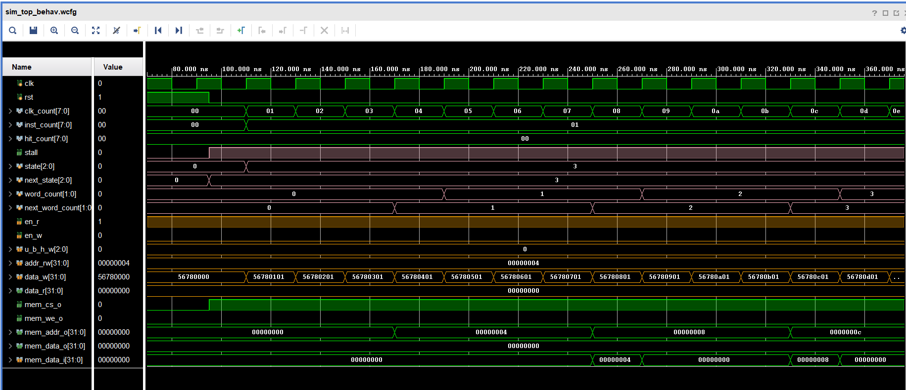
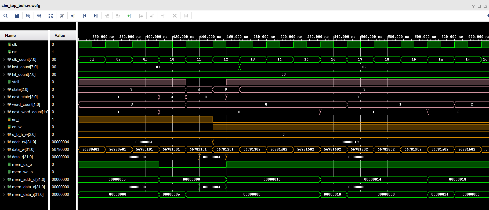
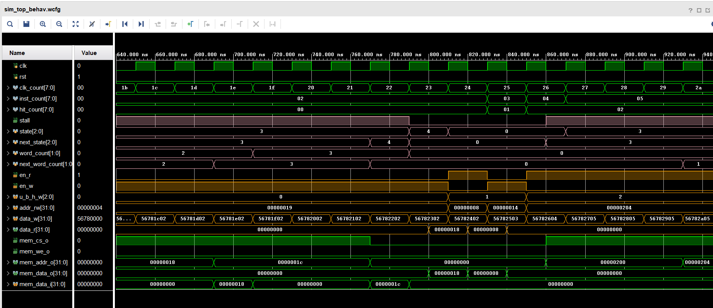
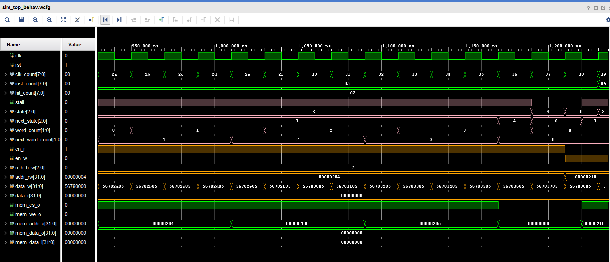
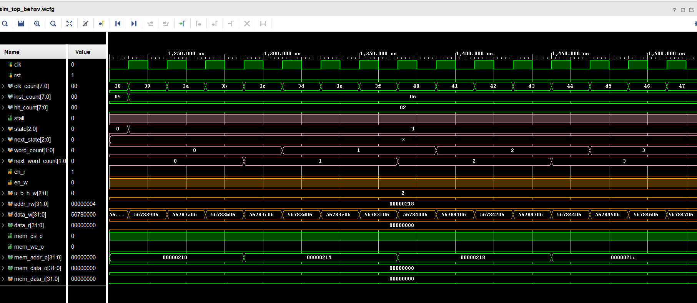
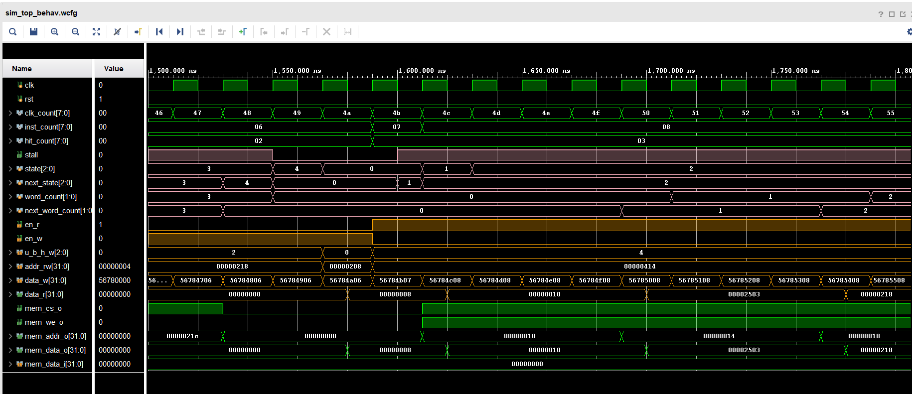
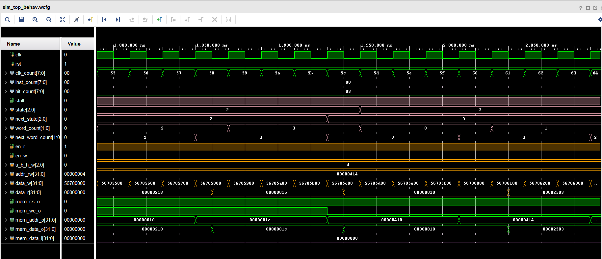

<style>
    pre code { /*实现代码块自动换行*/
        white-space: pre-wrap !important;; /* CSS 3 */
        white-space: -moz-pre-wrap !important; /* Firefox */
        white-space: -pre-wrap !important; /* Opera <7 */
        white-space: -o-pre-wrap !important; /* Opera 7 */
        word-wrap: break-word !important; /* Internet Explorer 5.5+ */
    }
</style>

<div style="height: 100pt;">
</div>

<div style="style=display: block; margin-left: auto; margin-right: auto; width: 60%; height: auto;">
  
  <br>
  <br>
</div>

<div style="height: 40pt;">
</div>

<div style="text-align:center;font-size:20pt;">
    <strong>体系结构实验报告</strong><br>
    <br>
</div>

<div style="height: 80pt;">
</div>

<div style="display: flex; align-items: center;justify-content: center;font-size:14pt;">
  <div style="display:flex; align-items: center; width: 70pt; background-color: rgba(255, 255, 255, 0);justify-content: center;">
课程名称<span style="margin-right: 7pt">:</span>
</div>
<div style="display:flex; align-items: center; width: 300pt; background-color: rgba(255, 255, 255, 0);justify-content: center;border-bottom: 1pt solid #000;">
计算机体系结构
</div>
</div>

<div style="height: 7pt;">
</div>

<div style="display: flex; align-items: center;justify-content: center;font-size:14pt;">
  <div style="display:flex; align-items: center; width: 70pt; background-color: rgba(255, 255, 255, 0);justify-content: center;">
实验项目<span style="margin-right: 7pt">:</span>
</div>
<div style="display:flex; align-items: center; width: 300pt; background-color: rgba(255, 255, 255, 0);justify-content: center;border-bottom: 1pt solid #000;">
Pipelined CPU supporting exception & interrupt
</div>
</div>

<div style="height: 7pt;">
</div>

<div style="display: flex; align-items: center;justify-content: center;font-size:14pt;">
  <div style="display:flex; align-items: center; width: 70pt; background-color: rgba(255, 255, 255, 0);justify-content: center;">
专<span style="margin-left: 28pt;"></span>业<span style="margin-right: 7pt">:</span>
</div>
<div style="display:flex; align-items: center; width: 300pt; background-color: rgba(255, 255, 255, 0);justify-content: center;border-bottom: 1pt solid #000;">
计算机科学技术
</div>
</div>

<div style="height: 7pt;">
</div>

<div style="display: flex; align-items: center;justify-content: center;font-size:14pt;">
  <div style="display:flex; align-items: center; width: 70pt; background-color: rgba(255, 255, 255, 0);justify-content: center;">
学生姓名<span style="margin-right: 7pt;">:</span>
</div>
<div style="display:flex; align-items: center; width: 300pt; background-color: rgba(255, 255, 255, 0);justify-content: center;border-bottom: 1pt solid #000;">
李浩浩
</div>
</div>

<div style="height: 7pt;">
</div>


<div style="display: flex; align-items: center;justify-content: center;font-size:14pt;">
  <div style="display:flex; align-items: center; width: 70pt; background-color: rgba(255, 255, 255, 0);justify-content: center;">
学<span style="margin-left: 28pt;"></span>号<span style="margin-right: 7pt">:</span>
</div>
<div style="display:flex; align-items: center; width: 300pt; background-color: rgba(255, 255, 255, 0);justify-content: center;border-bottom: 1pt solid #000;">
3220105930
</div>
</div>

<div style="height: 7pt;">
</div>

<div style="display: flex; align-items: center;justify-content: center;font-size:14pt;">
  <div style="display:flex; align-items: center; width: 70pt; background-color: rgba(255, 255, 255, 0);justify-content: center;">
指导老师<span style="margin-right: 7pt">:</span>
</div>
<div style="display:flex; align-items: center; width: 300pt; background-color: rgba(255, 255, 255, 0);justify-content: center;border-bottom: 1pt solid #000;">
何水兵
</div>
</div>

<div style="height: 7pt;">
</div>

<div style="display: flex; align-items: center;justify-content: center;font-size:14pt;">
  <div style="display:flex; align-items: center; width: 70pt; background-color: rgba(255, 255, 255, 0);justify-content: center;">
实验日期<span style="margin-right: 7pt">:</span>
</div>
<div style="display:flex; align-items: center; width: 300pt; background-color: rgba(255, 255, 255, 0);justify-content: center;border-bottom: 1pt solid #000;">
2024年11月4日
</div>
</div>

<div style="height: 7pt;">
</div>

<div style="page-break-before: always;"></div>

<div style="height: 14pt;">
</div>

### 一、实验目的、要求及任务

#### （一）实验目的

- Understand  the principle of Cache Management Unit (CMU) and State Machine of CMU
- Master the design methods of CMU and Integrate it to the CPU.
- Master verification methods of CMU and compare the performance of CPU when it - has cache or not.


#### （二）实验任务

- Design of Cache Management Unit and integrate it to CPU.

- Observe and Analyze the Waveform of Simulation.

- Compare the performance of CPU when it has cache or not.


### 二、实验原理

此次实验我们要实现的是 `Cache Management Unit` ，它的作用是向cache传递信号并控制周期停顿，cache的写回与写申请策略要依靠CMU的控制才能实现，下面是cache的控制策略。

将上面的流程图转化为状态机结果如下：


### 三、实验过程及数据记录




#### cmu.v

```verilog
module cmu (
        // CPU side
		input clk,
		input rst,
		input [31:0] addr_rw,
		input en_r,
		input en_w,
        input [2:0] u_b_h_w,
		input [31:0] data_w,
		output [31:0] data_r,
		output stall,

        // mem side
		output reg mem_cs_o = 0,
		output reg mem_we_o = 0,
		output reg [31:0] mem_addr_o = 0,
		input [31:0] mem_data_i,
		output [31:0] mem_data_o,
		input mem_ack_i,

        // debug info
        output [2:0] cmu_state
	);

    `include "addr_define.vh"

    reg [ADDR_BITS-1:0] cache_addr = 0;
    reg cache_load = 0;
    reg cache_store = 0;
    reg cache_edit = 0;
    reg [2:0] cache_u_b_h_w = 0;
    reg [WORD_BITS-1:0] cache_din = 0;
    wire cache_hit;
    wire [WORD_BITS-1:0] cache_dout;
    wire cache_valid;
    wire cache_dirty;
    wire [TAG_BITS-1:0] cache_tag;

    cache CACHE (
        .clk(~clk),
        .rst(rst),
        .addr(cache_addr),
        .load(cache_load),
        .store(cache_store),
        .edit(cache_edit),
        .invalid(1'b0),
        .u_b_h_w(cache_u_b_h_w),
        .din(cache_din),
        .hit(cache_hit),
        .dout(cache_dout),
        .valid(cache_valid),
        .dirty(cache_dirty),
        .tag(cache_tag)
    );

    localparam
        S_IDLE = 0,
        S_PRE_BACK = 1,
        S_BACK = 2,
        S_FILL = 3,
        S_WAIT = 4;

    reg [2:0]state = 0;
    reg [2:0]next_state = 0;
    reg [ELEMENT_WORDS_WIDTH-1:0]word_count = 0;
    reg [ELEMENT_WORDS_WIDTH-1:0]next_word_count = 0;
    assign cmu_state = state;

    always @ (posedge clk) begin
        if (rst) begin
            state <= S_IDLE;
            word_count <= 2'b00;
        end
        else begin
            state <= next_state;
            word_count <= next_word_count;
        end
    end

    // state ctrl
    always @ (*) begin
        if (rst) begin
            next_state = S_IDLE;
            next_word_count = 2'b00;
        end
        else begin
            case (state)
                S_IDLE: begin
                    if (en_r || en_w) begin
                        if (cache_hit)
                            next_state = S_IDLE;
                        else if (cache_valid && cache_dirty)
                            next_state = S_PRE_BACK;
                        else
                            next_state = S_FILL;
                    end
                    next_word_count = 2'b00;
                end

                S_PRE_BACK: begin
                    next_state = S_BACK;
                    next_word_count = 2'b00;
                end

                S_BACK: begin
                    if (mem_ack_i && word_count == {ELEMENT_WORDS_WIDTH{1'b1}})    // 2'b11 in default case
                        next_state = S_FILL;
                    else
                        next_state = S_BACK;

                    if (mem_ack_i)
                        next_word_count = word_count + 1;
                    else
                        next_word_count = word_count;
                end

                S_FILL: begin
                    if (mem_ack_i && word_count == {ELEMENT_WORDS_WIDTH{1'b1}})
                        next_state = S_WAIT;
                    else
                        next_state = S_FILL;

                    if (mem_ack_i)
                        next_word_count = word_count + 1;
                    else
                        next_word_count = word_count;
                end

                S_WAIT: begin
                    next_state = S_IDLE;
                    next_word_count = 2'b00;
                end
            endcase
        end
    end
    
    // cache ctrl
    always @ (*) begin
        case(state)
            S_IDLE, S_WAIT: begin
                cache_addr = addr_rw;
                cache_load = en_r;
                cache_edit = en_w;
                cache_store = 1'b0;
                cache_u_b_h_w = u_b_h_w;
                cache_din = data_w;
            end
            S_BACK, S_PRE_BACK: begin
                cache_addr = {addr_rw[ADDR_BITS-1:BLOCK_WIDTH], next_word_count, {ELEMENT_WORDS_WIDTH{1'b0}}};
                cache_load = 1'b0;
                cache_edit = 1'b0;
                cache_store = 1'b0;
                cache_u_b_h_w = 3'b010;
                cache_din = 32'b0;
            end
            S_FILL: begin
                cache_addr = {addr_rw[ADDR_BITS-1:BLOCK_WIDTH], word_count, {ELEMENT_WORDS_WIDTH{1'b0}}};
                cache_load = 1'b0;
                cache_edit = 1'b0;
                cache_store = mem_ack_i;
                cache_u_b_h_w = 3'b010;
                cache_din = mem_data_i;
            end
        endcase
    end
    assign data_r = cache_dout;

    // mem ctrl
    always @ (*) begin
        case (next_state)
            S_IDLE, S_PRE_BACK, S_WAIT: begin
                mem_cs_o = 1'b0;
                mem_we_o = 1'b0;
                mem_addr_o = 32'b0;
            end

            S_BACK: begin
                mem_cs_o = 1'b1;
                mem_we_o = 1'b1;
                mem_addr_o = {cache_tag, addr_rw[ADDR_BITS-TAG_BITS-1:BLOCK_WIDTH], next_word_count, {ELEMENT_WORDS_WIDTH{1'b0}}};
            end

            S_FILL: begin
                mem_cs_o = 1'b1;
                mem_we_o = 1'b0;
                mem_addr_o = {addr_rw[ADDR_BITS-1:BLOCK_WIDTH], next_word_count, {ELEMENT_WORDS_WIDTH{1'b0}}};
            end
        endcase
    end
    assign mem_data_o = cache_dout;

    assign stall = ~(next_state == S_IDLE);

endmodule
```

### 四、实验结果分析

#### （一）仿真








#### （二）上板
还未上板