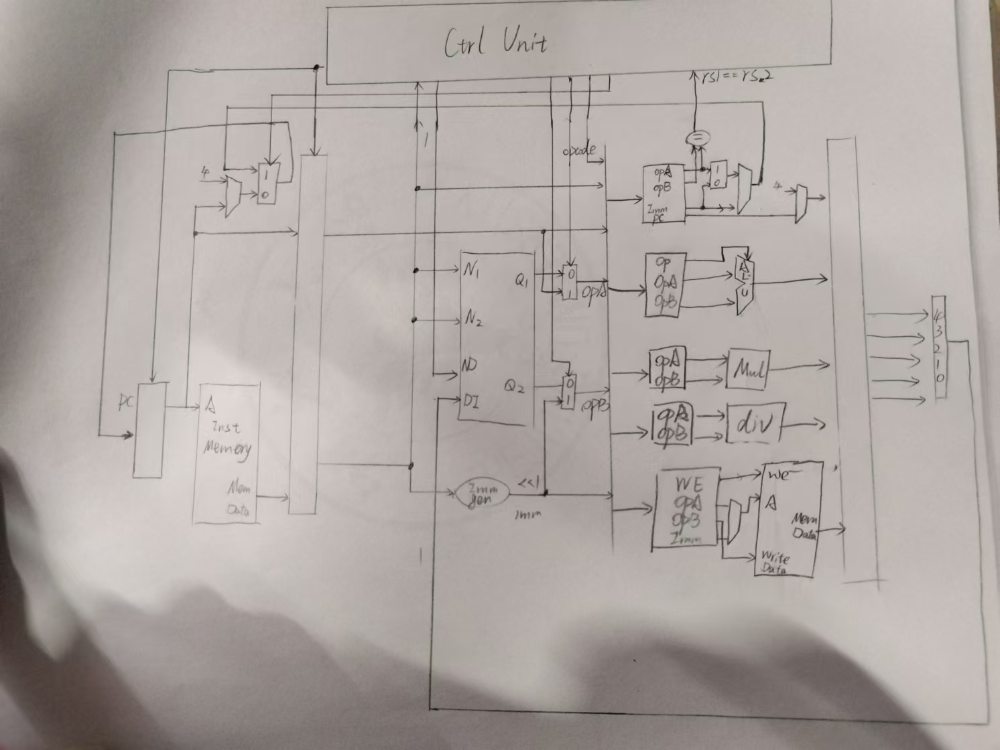
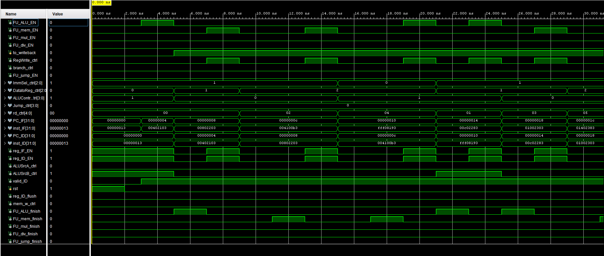
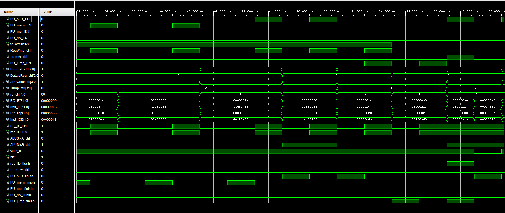
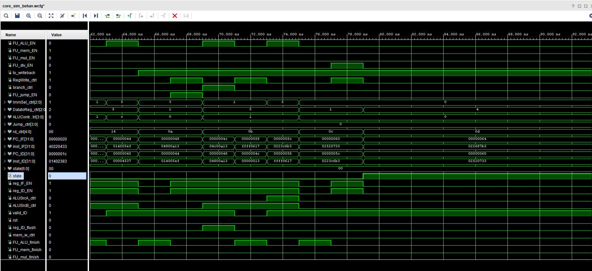
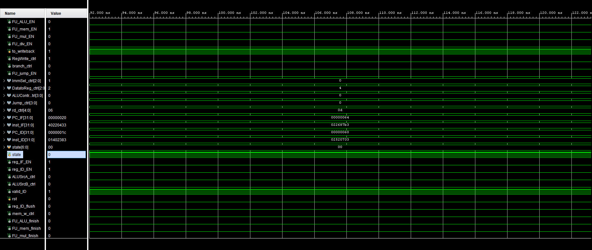
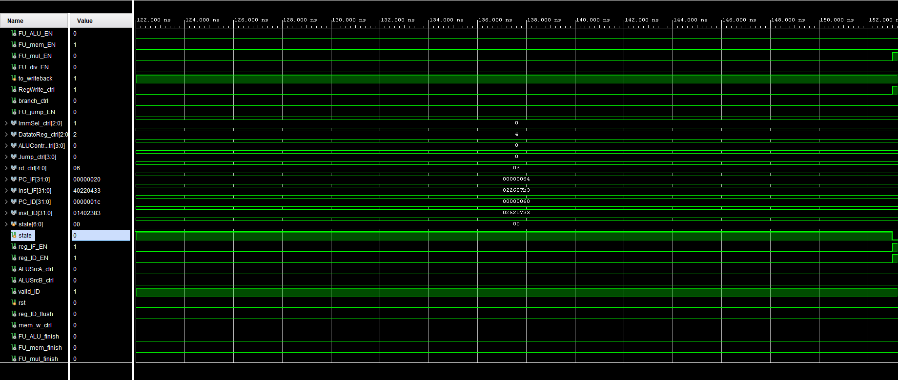
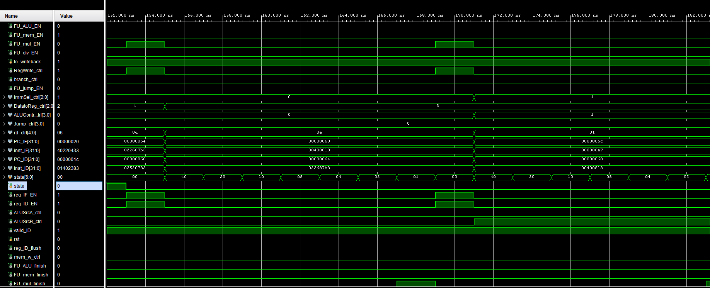
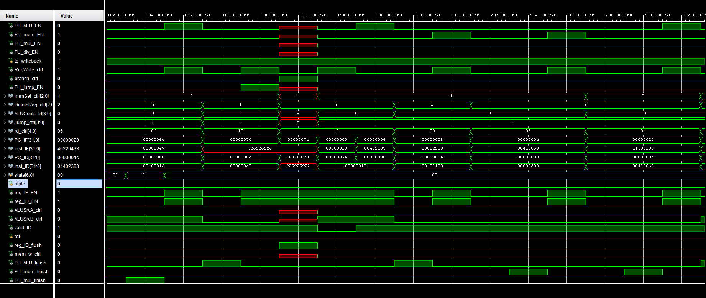

<style>
    pre code { /*实现代码块自动换行*/
        white-space: pre-wrap !important;; /* CSS 3 */
        white-space: -moz-pre-wrap !important; /* Firefox */
        white-space: -pre-wrap !important; /* Opera <7 */
        white-space: -o-pre-wrap !important; /* Opera 7 */
        word-wrap: break-word !important; /* Internet Explorer 5.5+ */
    }
</style>

<div style="height: 100pt;">
</div>

<div style="style=display: block; margin-left: auto; margin-right: auto; width: 60%; height: auto;">
  
  <br>
  <br>
</div>

<div style="height: 40pt;">
</div>

<div style="text-align:center;font-size:20pt;">
    <strong>体系结构实验报告</strong><br>
    <br>
</div>

<div style="height: 80pt;">
</div>

<div style="display: flex; align-items: center;justify-content: center;font-size:14pt;">
  <div style="display:flex; align-items: center; width: 70pt; background-color: rgba(255, 255, 255, 0);justify-content: center;">
课程名称<span style="margin-right: 7pt">:</span>
</div>
<div style="display:flex; align-items: center; width: 300pt; background-color: rgba(255, 255, 255, 0);justify-content: center;border-bottom: 1pt solid #000;">
计算机体系结构
</div>
</div>

<div style="height: 7pt;">
</div>

<div style="display: flex; align-items: center;justify-content: center;font-size:14pt;">
  <div style="display:flex; align-items: center; width: 70pt; background-color: rgba(255, 255, 255, 0);justify-content: center;">
实验项目<span style="margin-right: 7pt">:</span>
</div>
<div style="display:flex; align-items: center; width: 300pt; background-color: rgba(255, 255, 255, 0);justify-content: center;border-bottom: 1pt solid #000;">
Dynamically Scheduled Pipelines
</div>
</div>

<div style="height: 7pt;">
</div>

<div style="display: flex; align-items: center;justify-content: center;font-size:14pt;">
  <div style="display:flex; align-items: center; width: 70pt; background-color: rgba(255, 255, 255, 0);justify-content: center;">
专<span style="margin-left: 28pt;"></span>业<span style="margin-right: 7pt">:</span>
</div>
<div style="display:flex; align-items: center; width: 300pt; background-color: rgba(255, 255, 255, 0);justify-content: center;border-bottom: 1pt solid #000;">
计算机科学技术
</div>
</div>

<div style="height: 7pt;">
</div>

<div style="display: flex; align-items: center;justify-content: center;font-size:14pt;">
  <div style="display:flex; align-items: center; width: 70pt; background-color: rgba(255, 255, 255, 0);justify-content: center;">
学生姓名<span style="margin-right: 7pt;">:</span>
</div>
<div style="display:flex; align-items: center; width: 300pt; background-color: rgba(255, 255, 255, 0);justify-content: center;border-bottom: 1pt solid #000;">
李浩浩
</div>
</div>

<div style="height: 7pt;">
</div>


<div style="display: flex; align-items: center;justify-content: center;font-size:14pt;">
  <div style="display:flex; align-items: center; width: 70pt; background-color: rgba(255, 255, 255, 0);justify-content: center;">
学<span style="margin-left: 28pt;"></span>号<span style="margin-right: 7pt">:</span>
</div>
<div style="display:flex; align-items: center; width: 300pt; background-color: rgba(255, 255, 255, 0);justify-content: center;border-bottom: 1pt solid #000;">
3220105930
</div>
</div>

<div style="height: 7pt;">
</div>

<div style="display: flex; align-items: center;justify-content: center;font-size:14pt;">
  <div style="display:flex; align-items: center; width: 70pt; background-color: rgba(255, 255, 255, 0);justify-content: center;">
指导老师<span style="margin-right: 7pt">:</span>
</div>
<div style="display:flex; align-items: center; width: 300pt; background-color: rgba(255, 255, 255, 0);justify-content: center;border-bottom: 1pt solid #000;">
何水兵
</div>
</div>

<div style="height: 7pt;">
</div>

<div style="display: flex; align-items: center;justify-content: center;font-size:14pt;">
  <div style="display:flex; align-items: center; width: 70pt; background-color: rgba(255, 255, 255, 0);justify-content: center;">
实验日期<span style="margin-right: 7pt">:</span>
</div>
<div style="display:flex; align-items: center; width: 300pt; background-color: rgba(255, 255, 255, 0);justify-content: center;border-bottom: 1pt solid #000;">
2024年11月25日
</div>
</div>

<div style="height: 7pt;">
</div>

<div style="page-break-before: always;"></div>

<div style="height: 14pt;">
</div>

### 一、实验目的、要求及任务

#### （一）实验目的

- Understand  the principle of piplines that support multicycle operations.
- Master the design methods of piplines that support multicycle operations.
- Master verification methods of pipelined CPU supporting multicycle operations.

#### （二）实验任务

- Redesign the pipelines with IF/ID/FU/WB stages and FU stage supporting multicycle operations.
- Redesign of CPU Controller.
- Verify the Pipelined CPU with program and observe the execution of program.


### 二、实验原理

在设计 CPU 功能扩展和模块化的过程中，功能单元 (FU) 阶段被细分为五种功能模块，包括算术逻辑单元、访存单元、乘法单元、除法单元和跳转单元。每种单元完成指令所需的时钟周期不同，例如，算术逻辑单元（ALU）执行一条指令仅需一个时钟周期，而访存单元则需要两个周期，其他单元也有各自的延迟。

为解决数据相关问题，如果一条指令需要依赖之前指令的计算结果，那么必须等到前一指令的结果写回（即 WB 阶段结束）后，后续指令才能进入功能单元 (FU) 阶段。

在处理控制相关问题时，CPU 默认假设分支或跳转指令不发生跳转。若在功能单元阶段发现分支预测错误，则所有在该指令之后捕获的指令（共计两条）将被撤销，并从正确的目标地址开始重新取指。

原理图：


### 三、实验过程及数据记录

#### FU_ALU.v 补全部分

```verilog
    reg state;
    assign finish = state == 1'b1;
    initial begin
        state = 0;
    end

    reg[3:0] Control;
    reg[31:0] A, B;

    always@(posedge clk) begin
        if(EN & ~state) begin // state == 0
            Control <= ALUControl;            //to fill sth.in
            A <= ALUA;
            B <= ALUB;
            state <= 1;
        end
        else state <= 0;
    end
```
#### FU_div
```verilog
`timescale 1ns / 1ps

module FU_div(
    input clk, EN,
    input[31:0] A, B,
    output[31:0] res,
    output finish
);

    wire res_valid;
    wire[63:0] divres;
    
    reg state;
    assign finish = res_valid & state;
    initial begin
        state = 0;
    end

    reg A_valid, B_valid;
    reg[31:0] A_reg, B_reg;

    always@(posedge clk) begin
        if(EN & ~state) begin // state == 0
            A_reg <= A;
            B_reg <= B;
            A_valid <= 1;
            B_valid <= B ? 1 : 0;
            state <= 1;
        end
        else if(res_valid) begin
            A_valid <= 0;
            B_valid <= 0;
            state <= 0;
        end
    end


    divider div(.aclk(clk),
        .s_axis_dividend_tvalid(A_valid),
        .s_axis_dividend_tdata(A_reg),
        .s_axis_divisor_tvalid(B_valid), 
        .s_axis_divisor_tdata(B_reg),
        .m_axis_dout_tvalid(res_valid), 
        .m_axis_dout_tdata(divres)
    );

    assign res = divres[63:32];

endmodule
```

#### FU_jump.v
```verilog
`timescale 1ns / 1ps

module FU_jump(
	input clk, EN, JALR,
	input[2:0] cmp_ctrl,
	input[31:0] rs1_data, rs2_data, imm, PC,
	output[31:0] PC_jump, PC_wb,
	output cmp_res, finish
);

    reg state;
    assign finish = state == 1'b1;
	initial begin
        state = 0;
    end

	reg JALR_reg;
	reg[2:0] cmp_ctrl_reg;
	reg[31:0] rs1_data_reg, rs2_data_reg, imm_reg, PC_reg;

	always@(posedge clk) begin
        if(EN & ~state) begin // state == 0
            JALR_reg <= JALR;
			cmp_ctrl_reg <= cmp_ctrl;
			rs1_data_reg <= rs1_data;
			rs2_data_reg <= rs2_data;
			imm_reg <= imm;
			PC_reg <= PC;
            state <= 1;
        end
        else state <= 0;
    end

	cmp_32 cmp(.a(rs1_data_reg), .b(rs2_data_reg), .ctrl(cmp_ctrl_reg), .c(cmp_res));
	add_32 a(.a(PC_reg), .b(32'd4), .c(PC_wb));
	add_32 b(.a(JALR_reg ? rs1_data_reg : PC_reg), .b(imm_reg), .c(PC_jump));

endmodule
```

#### FU_mem.v
```verilog
`timescale 1ns / 1ps

module FU_mem(
    input clk, EN, mem_w,
    input[2:0] bhw,
    input[31:0] rs1_data, rs2_data, imm,
    output[31:0] mem_data,
    output finish
);

    reg[1:0] state;
    assign finish = state[0] == 1'b1;
    initial begin
        state = 0;
    end

    reg mem_w_reg;
    reg[2:0] bhw_reg;
    reg[31:0] rs1_data_reg, rs2_data_reg, imm_reg;

    always@(posedge clk) begin
        if(EN & ~|state) begin // state == 0
            mem_w_reg <= mem_w;
            bhw_reg <= bhw;
            rs1_data_reg <= rs1_data;
            rs2_data_reg <= rs2_data;
            imm_reg <= imm;
            state <= 2;
        end
        else state <= state >> 1;
    end

    wire[31:0] addr;
    add_32 a(.a(rs1_data_reg), .b(imm_reg), .c(addr));

    RAM_B ram(.clka(clk),.addra(addr),.dina(rs2_data_reg),.wea(mem_w_reg),
        .douta(mem_data),.mem_u_b_h_w(bhw_reg));

endmodule
```

#### FU_mul.v

```verilog
`timescale 1ns / 1ps

module FU_mul(
    input clk, EN,
    input[31:0] A, B,
    output[31:0] res,
    output finish
);
    wire [63:0] mulres;
    reg[6:0] state;
    assign finish = state[0] == 1'b1;
    initial begin
        state = 0;
    end

    reg[31:0] A_reg, B_reg;

    always@(posedge clk) begin
        if(EN & ~|state) begin // state == 0
            A_reg <= A;
            B_reg <= B;
            state[6] <= 1'b1;
        end
        else state <= state >> 1;
    end

    multiplier mul(.CLK(clk),.A(A_reg),.B(B_reg),.P(mulres));

    assign res = mulres[31:0];

endmodule
```

#### 顶层文件补全部分

```verilog
ImmGen imm_gen(.ImmSel(ImmSel_ctrl), .inst_field(inst_ID), .Imm_out(Imm_out_ID));

MUX2T1_32 mux_imm_ALU_ID_A(.I0(rs1_data_ID),.I1(PC_ID),.s(ALUSrcA_ctrl),.o(ALUA_ID));
MUX2T1_32 mux_imm_ALU_ID_B(.I0(rs2_data_ID),.I1(Imm_out_ID),.s(ALUSrcB_ctrl),.o(ALUB_ID));

MUX8T1_32 mux_DtR(.I0(),.I1(ALUout_WB),.I2(mem_data_WB),.I3(mulres_WB), .I4(divres_WB),.I5(PC_wb_WB),.I6(),.I7(),.s(DatatoReg_ctrl),.o(wt_data_WB));

```

### 四、实验结果分析

#### （一）仿真









#### （二）上板

还未上板。

#### 五、实验心得
这次实验一共debug三回，前两回是因为在不该出现红色的地方出现了红色，排查之后发现分别是rom和ram文件没有正确被项目识别到，将路径改为绝对路径之后遂解决。第三次是结尾没有出现红色，仔细核对指令，我发现程序卡在了`div x13, x7, x2`这个指令上。然后将`du`内的变量加入仿真视图之后发现其`state`一直处于`1`这个状态，原因是`B_valid`一直处于未知状态导致`res_valid`不为真，进而导致`state`无法归零，然后发现了一个不起眼的低级错误：
```verilog
always@(posedge clk) begin
        if(EN & ~state) begin // state == 0
            A_reg <= A;
            B_reg <= B;
            A_valid <= 1;
            B_valid <= B_reg ? 1 : 0;<----这是错的，B_reg与B_valid将被同时赋值，不能利用B_reg给B_valid赋值
            state <= 1;
        end
        else if(res_valid) begin
            A_valid <= 0;
            B_valid <= 0;
            state <= 0;
        end
    end
```

这次的实验debug比较得心应手，不像最开始只会瞪眼法，像无头苍蝇一样到处找问题。