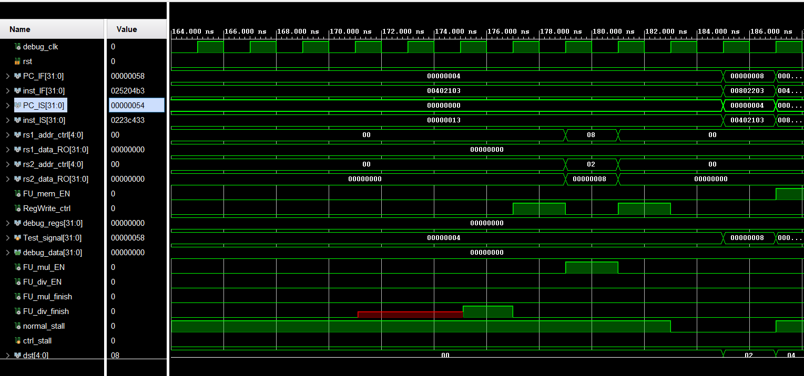

<style>
    pre code { /*实现代码块自动换行*/
        white-space: pre-wrap !important;; /* CSS 3 */
        white-space: -moz-pre-wrap !important; /* Firefox */
        white-space: -pre-wrap !important; /* Opera <7 */
        white-space: -o-pre-wrap !important; /* Opera 7 */
        word-wrap: break-word !important; /* Internet Explorer 5.5+ */
    }
</style>

<div style="height: 100pt;">
</div>

<div style="style=display: block; margin-left: auto; margin-right: auto; width: 60%; height: auto;">
  
  <br>
  <br>
</div>

<div style="height: 40pt;">
</div>

<div style="text-align:center;font-size:20pt;">
    <strong>体系结构实验报告</strong><br>
    <br>
</div>

<div style="height: 80pt;">
</div>

<div style="display: flex; align-items: center;justify-content: center;font-size:14pt;">
  <div style="display:flex; align-items: center; width: 70pt; background-color: rgba(255, 255, 255, 0);justify-content: center;">
课程名称<span style="margin-right: 7pt">:</span>
</div>
<div style="display:flex; align-items: center; width: 300pt; background-color: rgba(255, 255, 255, 0);justify-content: center;border-bottom: 1pt solid #000;">
计算机体系结构
</div>
</div>

<div style="height: 7pt;">
</div>

<div style="display: flex; align-items: center;justify-content: center;font-size:14pt;">
  <div style="display:flex; align-items: center; width: 70pt; background-color: rgba(255, 255, 255, 0);justify-content: center;">
实验项目<span style="margin-right: 7pt">:</span>
</div>
<div style="display:flex; align-items: center; width: 300pt; background-color: rgba(255, 255, 255, 0);justify-content: center;border-bottom: 1pt solid #000;">
Dynamically Scheduled Pipelines
</div>
</div>

<div style="height: 7pt;">
</div>

<div style="display: flex; align-items: center;justify-content: center;font-size:14pt;">
  <div style="display:flex; align-items: center; width: 70pt; background-color: rgba(255, 255, 255, 0);justify-content: center;">
专<span style="margin-left: 28pt;"></span>业<span style="margin-right: 7pt">:</span>
</div>
<div style="display:flex; align-items: center; width: 300pt; background-color: rgba(255, 255, 255, 0);justify-content: center;border-bottom: 1pt solid #000;">
计算机科学技术
</div>
</div>

<div style="height: 7pt;">
</div>

<div style="display: flex; align-items: center;justify-content: center;font-size:14pt;">
  <div style="display:flex; align-items: center; width: 70pt; background-color: rgba(255, 255, 255, 0);justify-content: center;">
学生姓名<span style="margin-right: 7pt;">:</span>
</div>
<div style="display:flex; align-items: center; width: 300pt; background-color: rgba(255, 255, 255, 0);justify-content: center;border-bottom: 1pt solid #000;">
李浩浩
</div>
</div>

<div style="height: 7pt;">
</div>


<div style="display: flex; align-items: center;justify-content: center;font-size:14pt;">
  <div style="display:flex; align-items: center; width: 70pt; background-color: rgba(255, 255, 255, 0);justify-content: center;">
学<span style="margin-left: 28pt;"></span>号<span style="margin-right: 7pt">:</span>
</div>
<div style="display:flex; align-items: center; width: 300pt; background-color: rgba(255, 255, 255, 0);justify-content: center;border-bottom: 1pt solid #000;">
3220105930
</div>
</div>

<div style="height: 7pt;">
</div>

<div style="display: flex; align-items: center;justify-content: center;font-size:14pt;">
  <div style="display:flex; align-items: center; width: 70pt; background-color: rgba(255, 255, 255, 0);justify-content: center;">
指导老师<span style="margin-right: 7pt">:</span>
</div>
<div style="display:flex; align-items: center; width: 300pt; background-color: rgba(255, 255, 255, 0);justify-content: center;border-bottom: 1pt solid #000;">
何水兵
</div>
</div>

<div style="height: 7pt;">
</div>

<div style="display: flex; align-items: center;justify-content: center;font-size:14pt;">
  <div style="display:flex; align-items: center; width: 70pt; background-color: rgba(255, 255, 255, 0);justify-content: center;">
实验日期<span style="margin-right: 7pt">:</span>
</div>
<div style="display:flex; align-items: center; width: 300pt; background-color: rgba(255, 255, 255, 0);justify-content: center;border-bottom: 1pt solid #000;">
2024年12月17日
</div>
</div>

<div style="height: 7pt;">
</div>

<div style="page-break-before: always;"></div>

<div style="height: 14pt;">
</div>

### 一、实验目的、要求及任务

#### （一）实验目的

- Understand  the principle of piplines that support multicycle operations.
- Understand  the principle of Dynamic Scheduling With a Scoreboard.
- Master the design methods of piplines that support multicycle operations.
- Master the design methods of Dynamically Scheduled Pipelines using Scoreboarding.
- Master verification methods of Dynamically Scheduled Pipelines using Scoreboarding.


#### （二）实验任务

- Redesign the pipelines with IF/IS/RO/FU/WB stages and supporting multicycle operations.

- Design of a scoreboard and integrate it to CPU.

- Verify the Pipelined CPU with program and observe the execution of program.


### 二、实验原理

原理图：


### 三、实验过程及数据记录

#### normal_stall

```verilog
assign normal_stall = ((R_valid | I_valid | L_valid | LUI | AUIPC | JAL | JALR)&						(RRS[rd]))|(use_ALU&FUS[`FU_ALU][`BUSY])|
    				(use_MEM&FUS[`FU_MEM][`BUSY])|
    				(use_MUL&FUS[`FU_MUL][`BUSY])|
    				(use_DIV&FUS[`FU_DIV][`BUSY])|
    				(use_JUMP&FUS[`FU_JUMP][`BUSY]);
```
检查所有功能单元（ALU、MEM、MUL、DIV、JUMP）是否忙碌（由 `FUS[fu][BUSY]` 判断）。如果任何功能单元正在忙碌并且当前指令需要该单元，则需要停顿等待资源。
#### 写后读检测（WAR）
```verilog
// ensure WAR:
    // If an FU hasn't read a register value (RO), don't write to it.
    wire ALU_WAR = (
        (FUS[`FU_MEM][`SRC1_H:`SRC1_L]  != FUS[`FU_ALU][`DST_H:`DST_L] | !FUS[`FU_MEM][`RDY1])  &    //fill sth. here
        (FUS[`FU_MEM][`SRC2_H:`SRC2_L]  != FUS[`FU_ALU][`DST_H:`DST_L] | !FUS[`FU_MEM][`RDY2])  &    //fill sth. here
        (FUS[`FU_MUL][`SRC1_H:`SRC1_L]  != FUS[`FU_ALU][`DST_H:`DST_L] | !FUS[`FU_MUL][`RDY1])  &    //fill sth. here
        (FUS[`FU_MUL][`SRC2_H:`SRC2_L]  != FUS[`FU_ALU][`DST_H:`DST_L] | !FUS[`FU_MUL][`RDY2])  &    //fill sth. here
        (FUS[`FU_DIV][`SRC1_H:`SRC1_L]  != FUS[`FU_ALU][`DST_H:`DST_L] | !FUS[`FU_DIV][`RDY1])  &    //fill sth. here
        (FUS[`FU_DIV][`SRC2_H:`SRC2_L]  != FUS[`FU_ALU][`DST_H:`DST_L] | !FUS[`FU_DIV][`RDY2])  &    //fill sth. here
        (FUS[`FU_JUMP][`SRC1_H:`SRC1_L] != FUS[`FU_ALU][`DST_H:`DST_L] | !FUS[`FU_JUMP][`RDY1])  &   //fill sth. here
        (FUS[`FU_JUMP][`SRC2_H:`SRC2_L] != FUS[`FU_ALU][`DST_H:`DST_L] | !FUS[`FU_JUMP][`RDY2])      //fill sth. here
    );

    wire MEM_WAR = (
        (FUS[`FU_ALU][`SRC1_H:`SRC1_L]  != FUS[`FU_MEM][`DST_H:`DST_L] | !FUS[`FU_ALU][`RDY1]) &    //fill sth. here
        (FUS[`FU_ALU][`SRC2_H:`SRC2_L]  != FUS[`FU_MEM][`DST_H:`DST_L] | !FUS[`FU_ALU][`RDY2]) &    //fill sth. here
        (FUS[`FU_MUL][`SRC1_H:`SRC1_L]  != FUS[`FU_MEM][`DST_H:`DST_L] | !FUS[`FU_MUL][`RDY1]) &    //fill sth. here
        (FUS[`FU_MUL][`SRC2_H:`SRC2_L]  != FUS[`FU_MEM][`DST_H:`DST_L] | !FUS[`FU_MUL][`RDY2]) &    //fill sth. here
        (FUS[`FU_DIV][`SRC1_H:`SRC1_L]  != FUS[`FU_MEM][`DST_H:`DST_L] | !FUS[`FU_DIV][`RDY1]) &    //fill sth. here
        (FUS[`FU_DIV][`SRC2_H:`SRC2_L]  != FUS[`FU_MEM][`DST_H:`DST_L] | !FUS[`FU_DIV][`RDY2]) &    //fill sth. here
        (FUS[`FU_JUMP][`SRC1_H:`SRC1_L] != FUS[`FU_MEM][`DST_H:`DST_L] | !FUS[`FU_JUMP][`RDY1]) &   //fill sth. here
        (FUS[`FU_JUMP][`SRC2_H:`SRC2_L] != FUS[`FU_MEM][`DST_H:`DST_L] | !FUS[`FU_JUMP][`RDY2])     //fill sth. here
    );

    wire MUL_WAR = (
        (FUS[`FU_ALU][`SRC1_H:`SRC1_L] != FUS[`FU_MUL][`DST_H:`DST_L] | !FUS[`FU_ALU][`RDY1]) &     //fill sth. here
        (FUS[`FU_ALU][`SRC2_H:`SRC2_L] != FUS[`FU_MUL][`DST_H:`DST_L] | !FUS[`FU_ALU][`RDY2]) &     //fill sth. here
        (FUS[`FU_MEM][`SRC1_H:`SRC1_L] != FUS[`FU_MUL][`DST_H:`DST_L] | !FUS[`FU_MEM][`RDY1]) &     //fill sth. here
        (FUS[`FU_MEM][`SRC2_H:`SRC2_L] != FUS[`FU_MUL][`DST_H:`DST_L] | !FUS[`FU_MEM][`RDY2]) &     //fill sth. here
        (FUS[`FU_DIV][`SRC1_H:`SRC1_L] != FUS[`FU_MUL][`DST_H:`DST_L] | !FUS[`FU_DIV][`RDY1]) &     //fill sth. here
        (FUS[`FU_DIV][`SRC2_H:`SRC2_L] != FUS[`FU_MUL][`DST_H:`DST_L] | !FUS[`FU_DIV][`RDY2]) &     //fill sth. here
        (FUS[`FU_JUMP][`SRC1_H:`SRC1_L]!= FUS[`FU_MUL][`DST_H:`DST_L] | !FUS[`FU_JUMP][`RDY1]) &    //fill sth. here
        (FUS[`FU_JUMP][`SRC2_H:`SRC2_L]!= FUS[`FU_MUL][`DST_H:`DST_L] | !FUS[`FU_JUMP][`RDY2])      //fill sth. here
    );

    wire DIV_WAR = (
        (FUS[`FU_ALU][`SRC1_H:`SRC1_L] != FUS[`FU_DIV][`DST_H:`DST_L] | !FUS[`FU_ALU][`RDY1]) &      //fill sth. here
        (FUS[`FU_ALU][`SRC2_H:`SRC2_L] != FUS[`FU_DIV][`DST_H:`DST_L] | !FUS[`FU_ALU][`RDY2]) &      //fill sth. here
        (FUS[`FU_MEM][`SRC1_H:`SRC1_L] != FUS[`FU_DIV][`DST_H:`DST_L] | !FUS[`FU_MEM][`RDY1]) &      //fill sth. here
        (FUS[`FU_MEM][`SRC2_H:`SRC2_L] != FUS[`FU_DIV][`DST_H:`DST_L] | !FUS[`FU_MEM][`RDY2]) &      //fill sth. here
        (FUS[`FU_MUL][`SRC1_H:`SRC1_L] != FUS[`FU_DIV][`DST_H:`DST_L] | !FUS[`FU_MUL][`RDY1]) &      //fill sth. here
        (FUS[`FU_MUL][`SRC2_H:`SRC2_L] != FUS[`FU_DIV][`DST_H:`DST_L] | !FUS[`FU_MUL][`RDY2]) &      //fill sth. here
        (FUS[`FU_JUMP][`SRC1_H:`SRC1_L]!= FUS[`FU_DIV][`DST_H:`DST_L] | !FUS[`FU_JUMP][`RDY1]) &     //fill sth. here
        (FUS[`FU_JUMP][`SRC2_H:`SRC2_L]!= FUS[`FU_DIV][`DST_H:`DST_L] | !FUS[`FU_JUMP][`RDY2])       //fill sth. here
    );

    wire JUMP_WAR = (
        (FUS[`FU_ALU][`SRC1_H:`SRC1_L] != FUS[`FU_JUMP][`DST_H:`DST_L] | !FUS[`FU_ALU][`RDY1]) &      //fill sth. here
        (FUS[`FU_ALU][`SRC2_H:`SRC2_L] != FUS[`FU_JUMP][`DST_H:`DST_L] | !FUS[`FU_ALU][`RDY2]) &      //fill sth. here
        (FUS[`FU_MEM][`SRC1_H:`SRC1_L] != FUS[`FU_JUMP][`DST_H:`DST_L] | !FUS[`FU_MEM][`RDY1]) &      //fill sth. here
        (FUS[`FU_MEM][`SRC2_H:`SRC2_L] != FUS[`FU_JUMP][`DST_H:`DST_L] | !FUS[`FU_MEM][`RDY2]) &      //fill sth. here
        (FUS[`FU_MUL][`SRC1_H:`SRC1_L] != FUS[`FU_JUMP][`DST_H:`DST_L] | !FUS[`FU_MUL][`RDY1]) &      //fill sth. here
        (FUS[`FU_MUL][`SRC2_H:`SRC2_L] != FUS[`FU_JUMP][`DST_H:`DST_L] | !FUS[`FU_MUL][`RDY2]) &      //fill sth. here
        (FUS[`FU_DIV][`SRC1_H:`SRC1_L] != FUS[`FU_JUMP][`DST_H:`DST_L] | !FUS[`FU_DIV][`RDY1]) &      //fill sth. here
        (FUS[`FU_DIV][`SRC2_H:`SRC2_L] != FUS[`FU_JUMP][`DST_H:`DST_L] | !FUS[`FU_DIV][`RDY2])        //fill sth. here
    );
```

 `XX_WAR` 表示 `FU_XX` 单元在执行运算时，是否会受到其他单元的写后读冲突。

`FUS[``FU_MEM][``SRC1_H:``SRC1_L] != FUS[``FU_ALU][``DST_H:``DST_L]`：检查 `FU_MEM` 的源寄存器是否与 `FU_ALU` 的目标寄存器是否相同，如果相同，则通过后面的分句检查`FU_MEM`的源寄存器是否已经准备好数据但`FU_MEM`尚未读取，如果是这样，则判定发生冲突

#### Scoreboard控制逻辑
Scoreboard管理不同功能单元（Functional Units，简称 FU）的状态以及与寄存器的交互，处理数据流向并控制流水线中不同阶段的操作。涉及了五个主要的功能单元：**JUMP**、**ALU**、**MEM**、**MUL**、**DIV**。这些功能单元通过一个**分配表**（`FUS`）和一个**寄存器重命名表**（`RRS`）来追踪它们的状态。
```verilog
// IS
            if (RO_en) begin
                // not busy, no WAW, write info to FUS and RRS
                if (|dst) RRS[dst] <= use_FU;
                FUS[use_FU][`BUSY] <= 1'b1;
                FUS[use_FU][`OP_H:`OP_L] <= op;                             //fill sth. here.
                FUS[use_FU][`DST_H:`DST_L] <=dst;
                FUS[use_FU][`SRC1_H:`SRC1_L] <= src1;
                FUS[use_FU][`SRC2_H:`SRC2_L] <= src2;
                FUS[use_FU][`FU1_H:`FU1_L] <= fu1;
                FUS[use_FU][`FU2_H:`FU2_L] <= fu2;
                FUS[use_FU][`RDY1] <= fu1 == 0;
                FUS[use_FU][`RDY2] <= fu2 == 0;
                // FUS[use_FU][`FU_DONE] <= 1'b0;
                
                IMM[use_FU] <= imm;
                PCR[use_FU] <= PC;
            end
```
在指令调度阶段（IS），如果 `RO_en` 信号有效，指令信息会被填充到功能单元（FUS）和寄存器重命名表（RRS）中。如果指令有目标寄存器（`dst`），更新该寄存器在重命名表中的条目，并将功能单元标记为忙碌状态。指令的操作类型、源寄存器、目标寄存器、功能单元标识等信息也会被填充到相应的功能字段中。
```verilog
            // RO
            if (FUS[`FU_JUMP][`RDY1] & FUS[`FU_JUMP][`RDY2]) begin
                // JUMP
                FUS[`FU_JUMP][`RDY1] <= 1'b0;
                FUS[`FU_JUMP][`RDY2] <= 1'b0;
            end
            else if (FUS[`FU_ALU][`RDY1] & FUS[`FU_ALU][`RDY2]) begin   //fill sth. here.
                // ALU
                FUS[`FU_ALU][`RDY1] <= 1'b0;
                FUS[`FU_ALU][`RDY2] <= 1'b0;
            end
            else if (FUS[`FU_MEM][`RDY1] & FUS[`FU_MEM][`RDY2]) begin   //fill sth. here.
                // MEM
                FUS[`FU_MEM][`RDY1] <= 1'b0;
                FUS[`FU_MEM][`RDY2] <= 1'b0;
            end
            else if (FUS[`FU_MUL][`RDY1] & FUS[`FU_MUL][`RDY2]) begin   //fill sth. here.
                // MUL
                FUS[`FU_MUL][`RDY1] <= 1'b0;
                FUS[`FU_MUL][`RDY2] <= 1'b0;
            end
            else if (FUS[`FU_DIV][`RDY1] & FUS[`FU_DIV][`RDY2]) begin   //fill sth. here.
                // DIV
                FUS[`FU_DIV][`RDY1] <= 1'b0;
                FUS[`FU_DIV][`RDY2] <= 1'b0;
            end
```
在读取操作阶段（RO），功能单元检查其是否准备好。如果功能单元的 `RDY1` 和 `RDY2` 都为 1，表示寄存器已经准备好数据，功能单元可以开始执行。

```verilog
FUS[`FU_ALU][`FU_DONE] <= FUS[`FU_ALU][`FU_DONE] | ALU_done;   //fill sth. here
FUS[`FU_MEM][`FU_DONE] <= FUS[`FU_MEM][`FU_DONE] | MEM_done;
FUS[`FU_MUL][`FU_DONE] <= FUS[`FU_MUL][`FU_DONE] | MUL_done;
FUS[`FU_DIV][`FU_DONE] <= FUS[`FU_DIV][`FU_DONE] | DIV_done;
FUS[`FU_JUMP][`FU_DONE] <= FUS[`FU_JUMP][`FU_DONE] | JUMP_done;
```

执行阶段更新功能单元的完成标志，当功能单元完成操作时，会向ctrl单元发送信号，由此更新完成标志。

```verilog
// WB
// JUMP
if (FUS[`FU_JUMP][`FU_DONE] & JUMP_WAR) begin
    FUS[`FU_JUMP] <= 32'b0;
    RRS[FUS[`FU_JUMP][`DST_H:`DST_L]] <= 3'b0;

    // ensure RAW
    if (FUS[`FU_ALU][`FU1_H:`FU1_L] == `FU_JUMP) FUS[`FU_ALU][`RDY1] <= 1;
    if (FUS[`FU_MEM][`FU1_H:`FU1_L] == `FU_JUMP) FUS[`FU_MEM][`RDY1] <= 1;
    if (FUS[`FU_MUL][`FU1_H:`FU1_L] == `FU_JUMP) FUS[`FU_MUL][`RDY1] <= 1;
    if (FUS[`FU_DIV][`FU1_H:`FU1_L] == `FU_JUMP) FUS[`FU_DIV][`RDY1] <= 1;

    if (FUS[`FU_ALU][`FU2_H:`FU2_L] == `FU_JUMP) FUS[`FU_ALU][`RDY2] <= 1;
    if (FUS[`FU_MEM][`FU2_H:`FU2_L] == `FU_JUMP) FUS[`FU_MEM][`RDY2] <= 1;
    if (FUS[`FU_MUL][`FU2_H:`FU2_L] == `FU_JUMP) FUS[`FU_MUL][`RDY2] <= 1;
    if (FUS[`FU_DIV][`FU2_H:`FU2_L] == `FU_JUMP) FUS[`FU_DIV][`RDY2] <= 1;
end
// ALU
if (FUS[`FU_ALU][`FU_DONE] & ALU_WAR) begin
    // clear the FUS
    FUS[`FU_ALU] <= 32'b0;
    RRS[FUS[`FU_ALU][`DST_H:`DST_L]] <= 3'b0;

    // ensure RAW
    if (FUS[`FU_JUMP][`FU1_H:`FU1_L] == `FU_ALU) FUS[`FU_JUMP][`RDY1] <= 1;
    if (FUS[`FU_MEM][`FU1_H:`FU1_L] == `FU_ALU) FUS[`FU_MEM][`RDY1] <= 1;
    if (FUS[`FU_MUL][`FU1_H:`FU1_L] == `FU_ALU) FUS[`FU_MUL][`RDY1] <= 1;
    if (FUS[`FU_DIV][`FU1_H:`FU1_L] == `FU_ALU) FUS[`FU_DIV][`RDY1] <= 1;

    if (FUS[`FU_JUMP][`FU2_H:`FU2_L] == `FU_ALU) FUS[`FU_JUMP][`RDY2] <= 1;
    if (FUS[`FU_MEM][`FU2_H:`FU2_L] == `FU_ALU) FUS[`FU_MEM][`RDY2] <= 1;
    if (FUS[`FU_MUL][`FU2_H:`FU2_L] == `FU_ALU) FUS[`FU_MUL][`RDY2] <= 1;
    if (FUS[`FU_DIV][`FU2_H:`FU2_L] == `FU_ALU) FUS[`FU_DIV][`RDY2] <= 1;
end
// ...;
// MEM
if (FUS[`FU_MEM][`FU_DONE] & MEM_WAR) begin
    // clear the FUS
    FUS[`FU_MEM] <= 32'b0;
    RRS[FUS[`FU_MEM][`DST_H:`DST_L]] <= 3'b0;

    // ensure RAW
    if (FUS[`FU_JUMP][`FU1_H:`FU1_L] == `FU_MEM) FUS[`FU_JUMP][`RDY1] <= 1;
    if (FUS[`FU_ALU][`FU1_H:`FU1_L] == `FU_MEM) FUS[`FU_ALU][`RDY1] <= 1;
    if (FUS[`FU_MUL][`FU1_H:`FU1_L] == `FU_MEM) FUS[`FU_MUL][`RDY1] <= 1;
    if (FUS[`FU_DIV][`FU1_H:`FU1_L] == `FU_MEM) FUS[`FU_DIV][`RDY1] <= 1;

    if (FUS[`FU_JUMP][`FU2_H:`FU2_L] == `FU_MEM) FUS[`FU_JUMP][`RDY2] <= 1;
    if (FUS[`FU_ALU][`FU2_H:`FU2_L] == `FU_MEM) FUS[`FU_ALU][`RDY2] <= 1;
    if (FUS[`FU_MUL][`FU2_H:`FU2_L] == `FU_MEM) FUS[`FU_MUL][`RDY2] <= 1;
    if (FUS[`FU_DIV][`FU2_H:`FU2_L] == `FU_MEM) FUS[`FU_DIV][`RDY2] <= 1;
end
// ...;
// MUL
if (FUS[`FU_MUL][`FU_DONE] & MUL_WAR) begin
    // clear the FUS
    FUS[`FU_MUL] <= 32'b0;
    RRS[FUS[`FU_MUL][`DST_H:`DST_L]] <= 3'b0;

    // ensure RAW
    if (FUS[`FU_JUMP][`FU1_H:`FU1_L] == `FU_MUL) FUS[`FU_JUMP][`RDY1] <= 1;
    if (FUS[`FU_ALU][`FU1_H:`FU1_L] == `FU_MUL) FUS[`FU_ALU][`RDY1] <= 1;
    if (FUS[`FU_MEM][`FU1_H:`FU1_L] == `FU_MUL) FUS[`FU_MEM][`RDY1] <= 1;
    if (FUS[`FU_DIV][`FU1_H:`FU1_L] == `FU_MUL) FUS[`FU_DIV][`RDY1] <= 1;

    if (FUS[`FU_JUMP][`FU2_H:`FU2_L] == `FU_MUL) FUS[`FU_JUMP][`RDY2] <= 1;
    if (FUS[`FU_ALU][`FU2_H:`FU2_L] == `FU_MUL) FUS[`FU_ALU][`RDY2] <= 1;
    if (FUS[`FU_MEM][`FU2_H:`FU2_L] == `FU_MUL) FUS[`FU_MEM][`RDY2] <= 1;
    if (FUS[`FU_DIV][`FU2_H:`FU2_L] == `FU_MUL) FUS[`FU_DIV][`RDY2] <= 1;
end
// ...;
// DIV
if (FUS[`FU_DIV][`FU_DONE] & DIV_WAR) begin
    // clear the FUS
    FUS[`FU_DIV] <= 32'b0;
    RRS[FUS[`FU_DIV][`DST_H:`DST_L]] <= 3'b0;

    // ensure RAW
    if (FUS[`FU_JUMP][`FU1_H:`FU1_L] == `FU_DIV) FUS[`FU_JUMP][`RDY1] <= 1;
    if (FUS[`FU_ALU][`FU1_H:`FU1_L] == `FU_DIV) FUS[`FU_ALU][`RDY1] <= 1;
    if (FUS[`FU_MEM][`FU1_H:`FU1_L] == `FU_DIV) FUS[`FU_MEM][`RDY1] <= 1;
    if (FUS[`FU_MUL][`FU1_H:`FU1_L] == `FU_DIV) FUS[`FU_MUL][`RDY1] <= 1;

    if (FUS[`FU_JUMP][`FU2_H:`FU2_L] == `FU_DIV) FUS[`FU_JUMP][`RDY2] <= 1;
    if (FUS[`FU_ALU][`FU2_H:`FU2_L] == `FU_DIV) FUS[`FU_ALU][`RDY2] <= 1;
    if (FUS[`FU_MEM][`FU2_H:`FU2_L] == `FU_DIV) FUS[`FU_MEM][`RDY2] <= 1;
    if (FUS[`FU_MUL][`FU2_H:`FU2_L] == `FU_DIV) FUS[`FU_MUL][`RDY2] <= 1;
end
// ...;
```

最后检查是否有功能单元在等待刚刚完成的单元的结果，如果有，将它们对应的源寄存器设置为就绪状态。

### 四、实验结果分析

#### （一）仿真




#### （二）上板

还未验收上板。

#### 五、实验心得
这次实验比较顺利，只有一个小地方卡了一下，就是normal_stall的判断，我一开始只判断了use_FU是否忙碌，忽略了指令是否合法，后面加上了这个子句才让仿真结果正确。